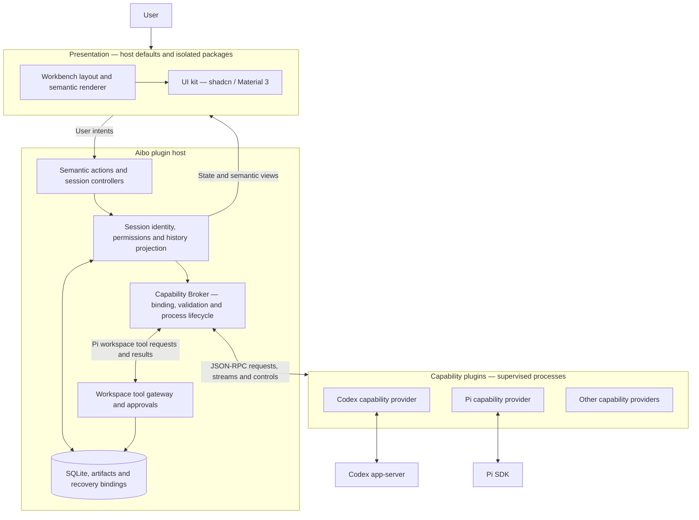

# Aibo

[English](README.md) | [简体中文](README_zh.md)

Aibo is a local coding workbench built from a **plugin host, capability plugins,
and presentation plugins**. Use Codex and Pi in one workspace, with host-owned
sessions, permissions, timelines, and execution history.

## What it does

- Manage workspaces and multiple Agent sessions; name conversations from the first message.
- Stream replies and tool activity, restore sessions, and inspect durable history.
- Use provider capabilities such as Codex approvals and branching, or Pi queues and tree navigation.
- Control workspace trust and session permissions. Broad access is confirmed when enabled;
  ordinary messages do not need a separate turn confirmation. Tool approvals follow the selected policy.
- Switch workbench layouts and shadcn / Material 3 skins through the presentation layer.
- Install capability plugins that expose versioned operations and declarative semantic views.

Capabilities vary by provider. See the [architecture and migration record](docs/capability-session-migration.md)
and [platform support matrix](docs/plugin-platform-support-matrix.md) for supported behavior and limits.

## Architecture



The host owns business state and authorization. Capability plugins implement operations
and native-engine integration. Presentation plugins decide how information and actions
are arranged and rendered; they do not grant permissions or execute business operations directly.
Native-engine enforcement and the host tool gateway are distinct boundaries: workspace
trust alone is not an operating-system sandbox.

A message travels from the composer through the host's session admission and Broker to
its pinned provider. Validated events update host history and flow back to the presentation.
The host keeps history readable when a provider is unavailable. Pi's active timeline combines
its native branch with persisted messages from the current turn.

**Current extension boundary:** capability and presentation packages can be installed locally
through separate installation paths. External presentation code runs in a terminable Worker
and returns a restricted visual tree, drawn by a trusted iframe bridge. It has no direct DOM,
network, storage or Tauri IPC access. The host retains management, approvals and recovery;
unprovided presentation surfaces inherit the host defaults. The old Agent Runtime v1 is
retired, and sessions without current capability bindings remain read-only history.

## Presentation release

The shadcn and Material 3 presentation packages are **0.3.0**, with shared workbench modules
at **0.2.0**. They support three layouts, draft and layout persistence, focus and message-anchor
restoration, and core semantic fallback. A theme-only Ocean example is also included.

Unzip a skin package, choose “安装皮肤插件” in Aibo settings, select the directory containing
`presentation.json`, then select the installed skin. See the [0.3.0 release guide](docs/presentation-release-0.3.0.md)
for local ZIPs, offline SDK tarballs and rebuild instructions, and the [exit audit](docs/presentation-plugin-exit-audit.md)
for verification evidence. Native acceptance covers macOS arm64; it does not establish
other-platform, physical-input or full screen-reader support.

## Run locally

Requirements: Node.js 22+, pnpm, a Rust toolchain, and the platform build dependencies
for Tauri 2. Codex sessions require `codex` on `PATH` and native authentication.
Pi sessions use the project-locked `@earendil-works/pi-coding-agent` SDK; configure
provider credentials for model requests. The Pi CLI is only required for its RPC probe.

```sh
pnpm install
pnpm tauri dev
```

```sh
pnpm dev          # Browser UI preview; desktop execution requires Tauri
pnpm run verify   # Architecture, TypeScript, Node tests, frontend build
cargo test --manifest-path src-tauri/Cargo.toml
```

macOS arm64 has native acceptance evidence. Other architectures and operating systems
have different validation and execution limits; consult the [support matrix](docs/plugin-platform-support-matrix.md).

## Develop plugins

Start with the [plugin development guide](docs/plugin-development.md) or its
[Chinese version](docs/plugin-development_zh.md). It covers the working example,
manifest and runtime contracts, packaging, installation, session providers, and presentation extensions.

| Resource | Purpose |
| --- | --- |
| [Capability example](examples/capability-plugin/) | Standalone TypeScript provider with a semantic view |
| [Plugin protocol](packages/plugin-protocol/) | Framework-independent data contracts |
| [Capability runtime](packages/capability-runtime/) | Node stdio runtime helper, including streaming and controls |
| [Web presentation types](packages/web-presentation/) | Local interface for trusted presentation implementations |
| [Presentation packages](docs/presentation-package.md) | Isolated package contract, Worker entry and build tools |
| [UI architecture](docs/ui-architecture.md) | UI kit boundaries and skin extension rules |

SDKs currently ship as local tarballs, not public registry packages.

## Validation and engine probes

```sh
pnpm run probe:session:capabilities # Offline provider workflows; no model requests
pnpm run probe:session:desktop     # Isolated native desktop probe; currently macOS
pnpm probe:codex
pnpm probe:pi:sdk
```

Real-model smoke probes are separate and require credentials. See the
[native engine probe guide](docs/native-engine-probes.md) for CLI requirements,
approval probes, executable overrides, and output locations.

## Repository map

| Directory | Contents |
| --- | --- |
| `src-tauri/src/` | Rust host, Broker, session lifecycle, permissions and persistence |
| `src-tauri/capability-plugins/` | Built-in Codex and Pi capability packages |
| `src/lib/app/` | Frontend business controllers |
| `src/lib/workbench/`, `src/lib/ui-kit/` | Presentation integration and visual adapters |
| `contracts/`, `packages/` | Versioned schemas and local SDKs |
| `examples/`, `fixtures/`, `test/`, `probes/` | Examples, test providers and validation tools |

Browse the [documentation index](docs/README.md) for current contracts and decisions.
Earlier designs and implementation reports live in the [archive](docs/archive/README.md).
