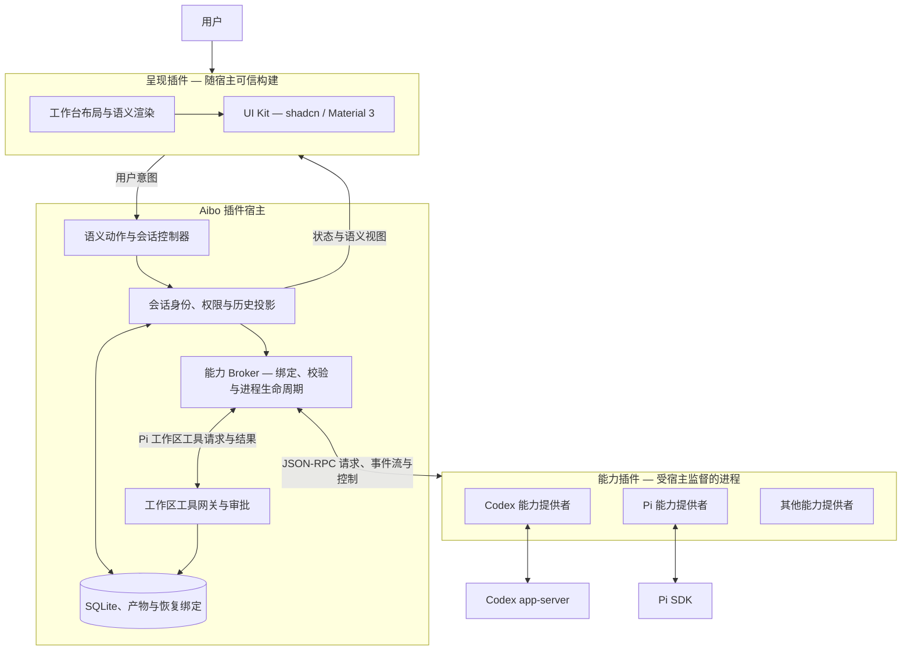

# Aibo

[English](README.md) | [简体中文](README_zh.md)

Aibo 是由 **插件宿主、能力插件和呈现插件**组成的本地编程工作台。
它将 Codex、Pi 等 Agent 接入同一工作区，由宿主管理会话、权限、时间线和执行历史。

## 主要能力

- 管理工作区和多个 Agent 会话，根据用户首条消息自动命名会话。
- 流式展示回复和工具活动，恢复会话，查看持久化历史。
- 使用不同提供者的能力，例如 Codex 审批与分支、Pi 队列与树导航。
- 管理工作区信任与会话权限。启用宽泛权限时确认，正常发送不逐条确认；具体工具仍遵循所选审批策略。
- 通过呈现层切换工作台布局和 shadcn / Material 3 皮肤。
- 安装提供版本化操作和声明式语义视图的能力插件。

各提供者的能力并不完全相同，具体支持范围见[架构与迁移记录](docs/capability-session-migration.md)
和[平台支持矩阵](docs/plugin-platform-support-matrix.md)。

## 分层架构与数据流



宿主拥有业务状态和授权决定；能力插件实现具体操作及原生引擎接入；呈现插件决定
信息与操作入口如何布局、渲染，不直接授予权限或执行业务操作。原生引擎的权限执行
和宿主工具网关是不同边界，工作区可信不等于操作系统沙箱。

发送消息时，输入经宿主会话准入和 Broker 到达会话固定绑定的提供者；返回事件经过
校验，写入宿主历史，再更新呈现层。插件不可用时，历史仍可读取。Pi 的活动时间线
由原生当前分支和宿主持久化的本轮消息共同组成。

**当前扩展边界：**能力包支持本地安装；呈现实现目前是随宿主构建的可信代码，安装包
不能动态向主 WebView 注入 JavaScript。旧 Agent Runtime v1 已退役，没有当前能力绑定
的旧会话仅保留历史读取。

## 本地运行

需要 Node.js 22+、pnpm、Rust 工具链及 Tauri 2 对应平台的构建依赖。
Codex 会话需要 `PATH` 中可用的 `codex` 和原生认证；Pi 会话使用项目锁定版本的
`@earendil-works/pi-coding-agent` SDK，模型调用需要配置提供商凭据。
Pi CLI 只用于独立的 RPC 探针。

```sh
pnpm install
pnpm tauri dev
```

```sh
pnpm dev          # 浏览器 UI 预览；实际桌面执行需要 Tauri
pnpm run verify   # 架构、TypeScript、Node 测试与前端构建
cargo test --manifest-path src-tauri/Cargo.toml
```

目前 macOS arm64 有原生验收证据。其他架构和操作系统的验证、执行限制不同，
请查阅[平台支持矩阵](docs/plugin-platform-support-matrix.md)。

## 开发插件

从[插件开发指引](docs/plugin-development_zh.md)开始，也可阅读[英文版](docs/plugin-development.md)。
指引包含可运行样例、清单与运行协议、打包安装、会话提供者和呈现扩展的开发路径。

| 资源 | 用途 |
| --- | --- |
| [能力插件样例](examples/capability-plugin/) | 独立 TypeScript 提供者与语义视图 |
| [插件协议包](packages/plugin-protocol/) | 不依赖 UI 框架的数据契约 |
| [能力 Runtime](packages/capability-runtime/) | Node stdio helper，支持流与执行中控制 |
| [Web 呈现类型](packages/web-presentation/) | 可信呈现实现的本地接口 |
| [UI 架构](docs/ui-architecture.md) | UI Kit 边界与皮肤扩展规则 |

SDK 目前通过本地 tarball 分发，尚未发布公共包注册表。

## 验证与引擎探针

```sh
pnpm run probe:session:capabilities # 离线提供者工作流，不调用模型
pnpm run probe:session:desktop     # 隔离的原生桌面探针，目前用于 macOS
pnpm probe:codex
pnpm probe:pi:sdk
```

真实模型 smoke 探针需单独运行并配置凭据。[原生引擎探针说明](docs/native-engine-probes.md)
保留了 CLI 要求、审批探针、可执行文件覆盖方式和输出位置。原始探针数据可能含本地
元数据，输出位于 Git 忽略的 `.aibo/probe/runs/`；只提交脱敏摘要与测试夹具。

## 目录导航

| 目录 | 内容 |
| --- | --- |
| `src-tauri/src/` | Rust 宿主、Broker、会话生命周期、权限和持久化 |
| `src-tauri/capability-plugins/` | 内置 Codex、Pi 能力包 |
| `src/lib/app/` | 前端业务控制器 |
| `src/lib/workbench/`、`src/lib/ui-kit/` | 呈现集成与视觉适配器 |
| `contracts/`、`packages/` | 版本化 schema 与本地 SDK |
| `examples/`、`fixtures/`、`test/`、`probes/` | 示例、测试提供者与验证工具 |

当前契约与设计决定见[文档索引](docs/README.md)，历史设计与实施报告见[归档索引](docs/archive/README.md)。
