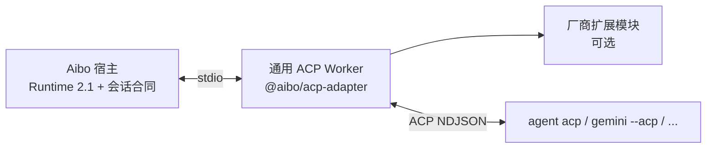
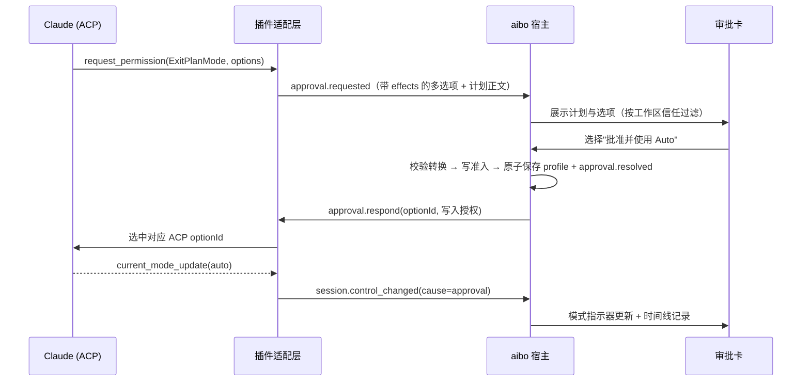

# ACP 作为 Agent 接入主干：迁移计划

状态：A1、A2、A3 已实施，A4 的通用 Worker 接线已完成；A5.1（多选项审批）已实施；A5.2、A6、A7 未实施。宿主会话合同、能力协商与执行授权规则不因本文改变；现行规则见
[会话能力协商](session-capability-negotiation.md)与[宿主和插件边界](plugin-boundaries-and-regression.md)。

## 背景与问题

Agent 现在有两种接入方式：

| 插件 | 位置 | 原生协议 | 规模 |
| --- | --- | --- | --- |
| Codex、Pi | `src-tauri/capability-plugins/` | Codex app-server、Pi SDK；共用 `session-provider.mjs` | 各约 780 行 engine |
| Cursor | `aibo-plugins/plugins/cursor/` | ACP（`agent acp`），Runtime 2.1 Worker | 约 960 行 |

Cursor 插件的代码大部分是通用 ACP 逻辑，并不专属于 Cursor：

- `acp-transport.mjs`（184 行）：NDJSON、双向 RPC、背压、超时、释放。与厂商完全无关。
- `cursor-session.mjs`（621 行）：`initialize`、`authenticate`、`session/new|load|prompt|cancel`、
  `session/update`、`session/request_permission`、`session/set_config_option` 属于标准 ACP；
  真正专属 Cursor 的只有 `cursor_login` 认证方式、`_meta.parameterizedModelPicker`，
  以及 `cursor/ask_question`、`cursor/create_plan`、`cursor/update_todos`、`cursor/task`、`cursor/generate_image` 扩展方法。

也就是说，每接入一个支持 ACP 的 Agent（Gemini CLI、Claude Code 的 ACP 适配器、Zed 生态的其他 Agent 等），
目前都要复制这约 800 行通用代码，并各自重做传输安全、超时和 recovery。

## 目标与非目标

目标：

- 支持 ACP 的 Agent **只写 `plugin.json` 和可选的扩展模块**即可接入，不再复制传输与会话映射代码。
- ACP 与 Aibo 会话合同之间的映射**只有一份实现、一份文档**，由宿主仓库维护并随 SDK 发布。
- 厂商扩展（`_meta`、`<vendor>/*` 扩展方法、非标准认证）通过显式扩展点接入，不写进通用层。

非目标：

- **不迁移 Codex、Pi。** 它们的原生引擎提供 fork、tree、timeline、goal、compaction、service-tier 等 ACP 未覆盖的能力。
  改走 ACP 会丢失功能，与"缺失能力显式降级"的原则相违。
- **不改变宿主线协议。** 宿主仍然只认 Capability runtime 2.1 和会话合同，ACP 只存在于插件进程内部。
  宿主不按"是否 ACP"分支，这与"不按 Agent 身份选择业务行为"的约束一致。
- 不放宽执行授权：ACP 客户端能力（fs、terminal）默认仍全部为 false，写操作仍经宿主确认。

## 目标形态



新增包 `packages/acp-adapter`（`@aibo/acp-adapter`），随 `@aibo/capability-runtime` 一起以本地 tarball 发布：

| 模块 | 来源 | 职责 |
| --- | --- | --- |
| `transport` | 从 Cursor `acp-transport.mjs` 提取 | 子进程、NDJSON、双向 RPC、帧上限、背压、超时、stderr 有界尾部 |
| `session` | 从 `cursor-session.mjs` 提取通用部分 | 握手、new/load 选择、prompt 串行、cancel、事件映射、审批与问答、recovery |
| `config` | 从 `model-config.mjs` 提取 | `config_option` → 模型/推理/上下文窗口的归一化 |
| `worker` | 新增 | 读取插件包内的 `acp.json`（或接受代码扩展），组装 Runtime 2.1 Worker |
| `extensions` | 新增接口 | 认证、`_meta`、扩展方法、扩展通知的钩子 |

插件形态：

```text
plugins/<agent>/
  plugin.json          # 清单 v2：会话操作与可执行依赖
  acp.json             # 插件自身的 ACP 配置
  worker.mjs           # 一行：serveAcpAgent({ manifestUrl, configUrl })
```

宿主清单 schema 不允许插件自定义字段，因此 ACP 配置放在独立的 `acp.json`，**不是宿主合同**，宿主不读取它
（实施时从原计划的 `plugin.json` 配置段改为此文件）：

```json
{
  "schema": "aibo.acp-agent/v1",
  "label": "My Agent",
  "command": "my-acp-agent",
  "args": ["--acp"],
  "modes": { "ask": "ask", "edit": "code" }
}
```

需要厂商扩展方法的 Agent 向 `serveAcpAgent` 传入代码扩展，Cursor 即如此。

可执行文件仍须在 `executableDependencies` 中声明，以参数数组、`shell:false` 启动；cwd 取可信工作区。

## ACP ↔ Aibo 会话映射

实施前需逐项对照 ACP protocolVersion 1 官方 schema。下表是基于 Cursor 插件现有实现整理的映射起点：

| ACP | Aibo | 说明 |
| --- | --- | --- |
| `initialize` + `authenticate` | `aibo.session.open` 的一部分 | 协议版本不一致即失败，不降级 |
| `session/new` / `session/load` | `aibo.session.open` create / resume | load 仅在 `agentCapabilities.loadSession` 时可用，否则 resume 明确失败 |
| `session/prompt` | `aibo.session.turn` / `aibo.session.turn.write` | 写回合额外校验 `workspace.write` |
| `session/cancel` | `aibo.session.cancel` | accepted 不等于已经停止 |
| 进程释放 | `aibo.session.close` | 不删除 Agent 侧历史 |
| `agent_message_chunk` | `message.delta` / `message.completed` | 仅 text 内容；其他类型作为 `adapter.warning` 记录 |
| `agent_thought_chunk` | `reasoning.updated` / `reasoning.completed` | |
| `tool_call` / `tool_call_update` | `tool.started` / `tool.updated` / `tool.completed` | 按 toolCallId 关联 |
| `session/request_permission` | `approval.requested` → `approval.respond` | 选项映射见下文"授权" |
| `available_commands_update` | `command.list` | |
| `config_option_update` / `session/set_config_option` | `model.select`、`model.reasoning`、`model.context-window` | 由 `config` 模块归一化，选择 ID 保持不透明 |
| 模式（`session/set_mode` 或模式类 config option） | `sessionControls` 中 `kind: mode` | 模式列表来自清单声明，并与 Agent 实际宣告取交集；当前宿主只支持静态声明，见"会话模式与回合内转换" |
| `current_mode_update` | `session.control_changed`（新增） | 宿主按"回合内转换"规则核对，不直接采信 |
| `usage_update` | `usage.updated` | |
| `promptCapabilities.image` | `image.input` | 仅在 Agent 宣告时声明 |
| `plan` 更新、计划审批正文 | 标准计划载荷（新增） | 贴近原生体验需要统一的计划视图，`extension.updated` 不足；见"会话模式与回合内转换" |
| `<vendor>/*` 扩展方法 / 通知 | 扩展模块 | 未注册的 request 返回 Method not found，未注册的 notification 忽略 |

能力声明规则：插件只声明 Agent 在握手中实际宣告的能力，走现有三层一致性检查（清单、Runtime 握手、open 返回）。
通用层**不得**因为 ACP 标准里有某项功能就默认声明。

### 授权

- ACP 的 `allow_once` / `reject_once` 直接映射为单次批准或拒绝。
- `allow_always` / `reject_always` 会让 Agent 记住决定，绕开宿主后续的逐次审批。通用层默认**不向用户展示**这两项；
  只有宿主会话策略明确允许持久授权时才展示。具体规则在实施前写入[会话控制](session-controls.md)。
  例外：选项带模式切换效果时（例如 Claude 的 ExitPlanMode），按"会话模式与回合内转换"处理，不适用本条。
- `executionPolicy: agent-managed` 的含义不变：Agent 自己的原生工具由 Agent 管理，宿主转发审批，不提供工作区沙箱。

### 执行后端选择

审批只有能拦住执行才有意义。解析 `tool_call` 通知做不到这一点：通知在工具执行时或执行后才到达。
因此通用层按 Agent 是否存在宿主可控的执行点选择后端，不为缺少执行点的 Agent 提供"简易审批"界面。

| 情况 | 执行点 | `executionPolicy` | 条件 |
| --- | --- | --- | --- |
| A. Agent 支持 ACP 客户端代理 `fs/*`、`terminal/*` | 通用层声明 fs/terminal 为 true，请求转给 CoreProxy 执行 | `core-proxy` | Agent 的同类原生工具必须关闭；一致性测试须证明原生工具写入失败或不存在 |
| B. Agent 可关闭内置工具、只用 MCP 工具 | CoreProxy 工具经 host-tools MCP 桥提供 | `core-proxy` | 需要扩展 `aibo.host-tools/v1`，加入写文件与执行命令工具（走合同变更门）；同样验证内置工具已关闭 |
| C. Agent 通过 `session/request_permission` 请求审批 | Agent 自己的权限机制 | `agent-managed` | 只有 Agent 实际发出的请求才出现在 aibo |
| D. 以上都没有 | 无 | 未协商（只读），或 `agent-managed` 且 `approvalPolicy: never` | 界面如实标明"由 Agent 自行管理权限，不经 aibo 审批"，不显示审批按钮 |

补充保障是每回合的变更记录（turn-changeset）、检查点（checkpoint）和还原功能，用于事后查看与回滚。
它们只提供事后可撤销，界面文案不得称为审批。`nativeSandbox` 始终为 false。

## 会话模式与回合内转换

以 Claude Code 为例（`@agentclientprotocol/claude-agent-acp` 0.81.2，旧的 `@zed-industries/claude-code-acp` 已冻结，
不支持 `auto`）。适配器通过 ACP session modes 与 `category: "mode"` 的 config option 暴露：

| ACP mode id | 适配器名称 | 条件 |
| --- | --- | --- |
| `default` | Manual | |
| `acceptEdits` | Accept edits | Claude Code 界面称 Edit automatically |
| `plan` | Plan | Auto 可用时，Plan 中经分类器批准的命令可以执行 |
| `auto` | Auto | 取决于模型（`supportsAutoMode`）与组织设置（`disableAutoMode`）；切到不支持的模型后，适配器悄悄降级为 `acceptEdits` |
| `bypassPermissions` | Bypass permissions | `session/new` 传 `_meta.claudeCode.options.allowDangerouslySkipPermissions: false` 可移除；aibo 不暴露 |

ExitPlanMode 审批会**直接切换模式**。可选项包括：清空上下文并使用 Auto/Accept edits、批准并使用 Auto、
自动接受编辑、手动审批编辑、继续规划。选中前几项后，Claude 在同一回合内切到对应模式并开始实施。

### 当前宿主的限制

| 限制 | 位置 |
| --- | --- |
| `approval.respond` 的 `decision` 只有 `accept` / `cancel`，多选项审批无法表达；Cursor 插件同样压成二选一 | `contracts/session-features.v1.json` |
| 会话处于 running / waiting_approval 时不能修改执行配置；修改成功后关闭运行时，下次 open 才生效 | `update_session_execution_profile`（`src-tauri/src/lib.rs`） |
| 写入准入按调用绑定；Plan 回合走只读 `aibo.session.turn`，中途无法取得写准入 | `workspace_write_runs`、`capability_broker.rs` |
| 没有"模式已变"事件，会话投影也不接受 | `session-event.v1.schema.json`、`session_projection.rs` |
| agent-managed 的 edit 模式强制 `approvalReviewer: "user"`，Auto 无法如实声明 | `execution_profile.rs`、`session_controls.rs` |
| 模式声明是静态的，无法反映 Auto 的动态可用性 | [会话控制](session-controls.md) |

在这些限制下，只有 Manual 和 Plan 能如实接入；Accept edits 只能声明与 Manual 相同的配置。
如果 Claude 在宿主不知情时从 Plan 切到可写模式，宿主仍按只读回合处理，但 Claude 已开始写文件。
因此在下文改动完成前，插件必须拦截 ExitPlanMode 的模式切换选项，只保留"批准并保持 Plan"与"继续规划"。
插件收到非宿主发起的 `current_mode_update` 时，必须中止回合并报告 `adapter.warning`。

### 目标：审批即转换，由宿主提交

模式切换是审批的结果，由宿主提交。用户在 aibo 审批卡上的选择，既是对计划的同意，也是写入准入。
宿主先落库，再通知 Agent 切换；Agent 回报的 `current_mode_update` 只用来核对，不作为依据。



### 合同改动

- **多选项审批**：`approval.requested` 载荷新增 `options: [{ id, label, kind, effects? }]`，
  其中 `effects` 为 `{ sessionControl: "<controlId>", contextReset?: true }`。`approval.respond` 新增
  `{ requestId, optionId }` 输入形态，作为新的功能合同版本单独协商；只支持二选一的插件继续走旧路径。
- **新事件 `session.control_changed`**：`{ controlId, previousControlId, cause: approval | fallback | agent, requestId? }`。
- **清单声明转换**：`sessionControls` 的每一项新增：
  - `transitions`：允许经审批从哪些模式切入，例如 plan 可以切到 manual、acceptEdits、auto；
  - `fallback`：允许的自动降级，例如 auto 降级到 acceptEdits。

  必须显式声明，因为 Manual 与 Accept edits 的执行配置相同，宿主无法从配置推断权限高低。
- **agent-managed 允许 `approvalReviewer: "auto-review"`**，用于如实声明 Auto。界面须说明审批方是 Agent 自己的分类器，不是 aibo。
- **标准计划载荷**：计划正文与待办项使用统一结构，默认呈现与外部呈现都能渲染。
- **可用模式协商**：open 返回 Agent 当前实际可用的模式；宿主与清单声明取交集，不可用的选项置灰。

### 宿主改动

- **回合内转换路径**：与空闲时修改配置分开，不关闭运行时。处理带模式效果的审批响应时依次：
  1. 校验选项属于当前请求，代际与回合一致；
  2. 校验目标模式已声明，且转换在 `transitions` 中；
  3. 检查工作区信任与会话未归档；
  4. 为当前调用补一条 `workspace_write_runs` 写准入记录；
  5. 在同一事务中保存新执行配置与 `approval.resolved`。

  任一步失败，按拒绝回应 Agent，并在审批卡显示原因。
- **核对 Agent 回报**：
  - 与宿主已提交的转换一致：确认；
  - 属于声明的 `fallback`：接受并提示用户；
  - 未经提交的升级：取消回合，报告 `adapter.warning`；下次 open 时按宿主记录的模式重新 set_mode。
- **历史投影**：接受 `session.control_changed`，时间线写系统记录，例如"批准计划后切换到 Auto"。
- **重启恢复**：等待审批期间应用重启，未决审批作废，以宿主保存的模式为准。

### 插件改动

- ExitPlanMode 选项映射：`exitPlanAuto` → auto，`exitPlanAcceptEdits` → acceptEdits，`exitPlanDefault` → manual，
  reject → 继续规划（无 effects）。标签由插件提供中文，不透传 Agent 的英文文案。
- 回应审批后等待 `current_mode_update`，收到后发出 `session.control_changed`；超时报告警告。
- 计划正文取自 ExitPlanMode 的 `input.plan`，按标准计划载荷发出。
- Cursor 的 `cursor/create_plan` 复用同一机制。

### 界面改动

- 审批卡支持多选项：批准类与拒绝类使用不同的按钮意图，计划正文用共享 Markdown 渲染；
  未通过信任检查的升级选项置灰并说明原因。
- Composer 的模式指示器绑定宿主执行配置，收到 `session.control_changed` 后实时更新并短暂高亮。
- 审批属于宿主固定区域；外部呈现只需从快照读取新的当前模式与时间线条目，快照新增字段属于小版本变更。

### "清空上下文"类选项

Claude 的"清空上下文并使用 Auto/Accept edits"会重置上下文，可能对应新的原生会话，涉及原生会话绑定的更新规则。
第一期隐藏这类选项，单独设计后再开放（A6）。

### 宿主工具

ACP 的 `session/new` 接受 `mcpServers`。Cursor 0.1.18 已通过 SDK 私有 MCP bridge 接入
宿主授权的 `aibo.host-tools/v1` 目录，并有真实调用及跨进程恢复证据；A1 保留这条路径。
通用 `AcpSession` 已接收 `mcpServers`，但创建 bridge 和传入目录仍由 Cursor Worker 负责。
A4 剩余工作是将这段接线提供给 A2 的通用 Worker，并验证第二个 Agent；不重复实现历史工具，
也不扩大现有授权范围。新增文件写入或命令工具仍需单独决定。

## 阶段

### A1：提取 `@aibo/acp-adapter`（行为不变）

- 从 Cursor 插件提取 transport、session 通用部分、config 到 `packages/acp-adapter`。Cursor 专属逻辑移到 `extension.mjs`。
- Cursor 插件改为依赖该包，版本升到 0.2.0，manifest 能力声明不变。
- 将 `aibo-plugins/test/acp-transport.test.mjs`、`cursor-session.test.mjs` 中的通用用例迁到 `aibo/test/acp-adapter.test.mjs`；
  Cursor 仓库只保留扩展与清单测试。

验收：Cursor 插件在同一宿主上的 open、turn、cancel、审批、问答、模型切换、图片输入、recovery、
进程退出清理行为不变。运行 `aibo-plugins` 的 `pnpm run verify`，并按
[Cursor 验收清单](../../aibo-plugins/docs/cursor-acp-checklist.md)做 macOS arm64 真机复验。

#### A1 实施记录

- 新增 `packages/acp-adapter`，作为宿主 SDK 0.1.2 的一部分交付（插件以 `hostSdk` 运行时导入，开发时作为 devDependency），
  与迁移计划"随 SDK 发布"的决定一致。入口：`session`、`transport`、`config`、`image-input`。SDK 仅新增导出，
  声明 `< 0.2.0` 的已有插件不受影响。
- `AcpSession` 通过扩展对象接入厂商差异，而不是计划中的独立 `extension.mjs` 文件：必填 `label`、`command`、
  `recoverySchema`、`namespace`、`writableMode`、`validateExecutionProfile`；可选钩子覆盖认证、客户端元数据、
  空会话持久化、命令分类、参数化模型判定、子 Agent 识别，以及厂商请求和通知。钩子只拿到一个窄接口。
- 错误信息中的产品名由 `label` 生成；审批请求 ID 前缀可配置，Cursor 保持 `cursor-`，避免宿主审批记录变化。
- Cursor 插件 0.2.0 只保留 `cursorExtension`，要求宿主 SDK 0.1.2；测试和探针通过 `scripts/host-sdk.mjs` 加载目标宿主 SDK。
- 验证：Cursor 插件原有 38 项会话与清单测试未改一行，经宿主 SDK 加载器全部通过；`aibo-plugins` 的 `pnpm run verify`
  （含打包 Worker 冒烟）通过；传输、配置、图片输入测试迁到宿主 `test/acp-adapter-*.test.mjs`，另增通用会话测试
  （无认证、空会话恢复、默认前缀、厂商方法回退）；真实 Cursor CLI 2026.09.18 下 `probe-cursor-models`（40 个模型、切换、跨进程恢复）
  与 `probe-cursor-commands`（74 个命令、原生命令执行）通过。
- 当时未做：会发送模型请求的 `probe-cursor-parameters`，以及桌面宿主中的完整会话交互复验。后续结果见下节。

#### A1 复验与修正（2026-09-27）

- 宿主 SDK 0.1.2 通用层仅在 `loadSession: true` 时声明恢复，不再默认声明厂商提问；
  Cursor 0.2.1 显式声明已实现的提问扩展，并修正问题正文及显示标签到原生选项 ID 的映射。
  版本为本地构建基线，尚未发布。
- 两仓库 `pnpm run verify` 通过；宿主 491 项测试及独立架构检查通过，插件 40 项测试及打包 Worker smoke 通过。
  Rust 会话合同 4 项、跨进程恢复 1 项通过。
- 真实 CLI 参数探针通过 Auto 回合、GPT-5.5/Sonnet 4.6 推理与上下文配置及跨进程恢复。
  隔离 macOS WKWebView 中，真实 App 通过发送、图片预览与理解、取消、两次审批、应用重启后上下文恢复；
  新会话绑定 0.2.1，旧会话保留 0.1.18 并可重新打开。双皮肤浅/深色菜单与三种模式操作另有桌面证据。
- 本机 CLI 在 Agent/Plan 探测中未发出结构化提问；适配器→宿主投影→真实问题界面的浏览器回放通过，
  不能代替原生提问验收。多选、完整计划交互等仍未补齐，A1 不标为全部验收完成。
- 精确环境、命令、分层结果和脱敏证据见[Cursor 当前复验记录](../../aibo-plugins/docs/cursor-acp-validation.md)
  与[验收清单](../../aibo-plugins/docs/cursor-acp-checklist.md)。

### A2：清单驱动的通用 Worker

- 实现 `worker` 模块与 `acp` 配置段的校验（在插件进程启动时校验，失败时握手报错，而不是运行中失败）。
- 在 `aibo-plugins` 新增 `plugins/acp-template`：只有 `plugin.json` 与一行 `worker.mjs`，用于新 Agent 起步。
- 在[插件开发指引](plugin-development_zh.md)增加"接入 ACP Agent"一节。

验收：用仓库内的 ACP 回显夹具 Agent（新增，放在 `fixtures/`）完成完整生命周期。
夹具 Agent 覆盖 loadSession 有/无、图片有/无、审批四种选项，以及未知扩展方法。

#### A2 实施记录

- `@aibo/acp-adapter/worker` 的 `serveAcpAgent` 随宿主 SDK 0.1.3 交付（0.1.2 已有复验基线，新增入口不并入该版本）。
  它读取 `plugin.json` 与 `acp.json`，或接受代码扩展；功能按 `<pluginId>.<feature>` 路由，并包含宿主工具的 MCP bridge 接线（A4）。
- `acp.json` 校验：`command` 必须是清单 `executableDependencies` 中声明的可执行文件，`modes` 把 `ask`/`plan`/`edit`
  映射到原生模式 ID（`edit` 是写入模式），其余字段可选。无效时 Worker 在握手前以错误退出。执行配置沿用 `agent-managed` 规则。
- 修正通用层的模式切换：Agent 返回模式配置项时沿用 `session/set_config_option`（Cursor 路径不变）；只提供 session modes API 时
  改用标准 `session/set_mode`。此前后者会在打开会话时失败。
- Cursor 0.2.2 的 Worker 改为调用 `serveAcpAgent` 并传入 `cursorExtension`，与模板共用同一套路由；要求 SDK 0.1.3。
- `aibo-plugins/plugins/acp-template` 只有 `plugin.json`、`acp.json` 与一行 `worker.mjs`，随构建打包。
- 验证：宿主 `test/acp-worker.test.mjs` 以回显夹具 `fixtures/acp/echo-agent.mjs` 与只靠配置的 `fixtures/plugins/acp-echo`
  跑真实 Worker 进程，覆盖 loadSession 有/无、图片有/无、两种模式接口、审批四种选项只选 `allow_once`、未注册厂商方法得到
  Method not found、跨进程恢复、取消、宿主工具经 MCP 传给 Agent，以及无效 `acp.json`；`aibo-plugins` 新增模板清单与合同一致性测试，
  `pnpm run verify` 与 Cursor 打包 Worker 冒烟（含宿主工具）通过。
- 未做：Cursor 0.2.2 的真实 CLI 与桌面复验（路由代码未变，只是改由 SDK 提供）。

### A3：第二个真实 ACP Agent

选一个无需厂商扩展的 ACP Agent 作为第二个真实消费者，证明"只写清单即可接入"。候选需满足：
本机可安装、有稳定的 ACP 入口、许可允许本地调用。具体选型在实施时确定并记录。

验收：除 `plugin.json` 外不写任何代码；若需要代码，把需求提炼进通用层或扩展接口，而不是写进该插件。

#### A3 实施记录（Claude Code）

- 第二个真实 Agent 选用 Claude Code，经 `@agentclientprotocol/claude-agent-acp` 0.81.2 接入（Claude Code 2.1.280）。
  `aibo-plugins/plugins/claude-code` 只有 `plugin.json`、`acp.json` 和模板的一行 Worker，未写插件代码。
- `acp.json`：命令 `claude-agent-acp`；`edit` 映射 Claude 的 `default`（Manual，编辑与命令发审批），`plan` 映射 `plan`；
  不映射 `ask`（Claude 没有无工具的只读模式）；不设 `authMethodId`（沿用本机 Claude Code 登录）；`persistsEmptySessions: false`。
  Accept edits、Auto 与 Bypass 不暴露，理由见"会话模式与回合内转换"。
- 接入暴露并修正了一个通用层缺陷：此前只要识别为参数化模型配置就同时声明推理强度与上下文窗口。Claude 没有上下文窗口选项，
  宿主会显示一个空控件。现在只声明 Agent 实际返回的参数；Cursor 以 `parameterizedPicker: true` 保持原有行为。
- 验证：`aibo-plugins/scripts/probe-claude-code.mjs` 用真实 Claude Code 跑打包前的插件 Worker：Plan 会话能力按握手收窄
  （含恢复、图片、模型、推理强度，不含上下文窗口与提问），44 个命令、5 个模型、6 档推理强度；Plan 回合按要求回复；
  Manual 写入回合经 aibo 审批一次后写出文件，审批 ID 前缀为 `claude-`；新 Worker 进程经 `session/load` 恢复会话。
  证据见 `aibo-plugins/docs/baselines/claude-code-a3/probe.json`。插件仓库新增只靠配置插件的清单与合同一致性测试。
- 已知差距：Claude 的 AskUserQuestion 走 ACP elicitation，通用层未实现，Agent 收到 Method not found；
  Plan 中批准计划会请求切换模式并被拒绝，需在 aibo 中手动切到 Manual（A5）。未做桌面宿主中的完整会话交互复验。

### A4：将已有 MCP 宿主工具接入通用 Worker

- 复用 Cursor 0.1.18 已有的 SDK bridge，在 A2 Worker 中按配置建立、传入并关闭 MCP server；恢复时重建凭证并保留公开 server 身份。
- 宿主授权按现有 host-tools 规则执行；Agent 调用宿主工具时仍校验调用归属、代际与信任。

前提：沿用 [会话历史工具设计](session-history-tool-design.md)的现行授权模型；新增工具或扩大数据范围须另行决策。

### A5：多选项审批与回合内模式转换

- 实施"会话模式与回合内转换"中的合同、宿主、插件和界面改动。
- 在此之前，Claude Code 插件只暴露 Manual 与 Plan，并拦截 ExitPlanMode 的模式切换选项。

验收：
- 夹具 ACP Agent 覆盖：批准后切到 Auto、Manual、Accept edits；继续规划；工作区不可信时拒绝升级；
  未经提交的升级触发中止；切模型导致 Auto 降级；等待审批期间重启；代际变化后迟到的审批响应。
- 浏览器探针检查模式指示器与时间线；在 macOS arm64 上用真实 Claude CLI 走完"规划 → 批准 → 实施"。

#### A5.1 实施记录：多选项审批（2026-09-27）

A5 分两步：A5.1 只接通多选项审批的通道，不改执行配置；A5.2 再做回合内模式转换。

- 合同：`approval.respond` 新增第二个输入形态 `{ requestId, optionId }`（两字段均为非空字符串，不允许其他字段），
  输出不变。插件在清单中声明哪个形态，Broker 就按哪个形态校验；旧插件仍走 `decision`。
- 适配层：Worker 根据清单中 `approval.respond` 的 `inputSchema` 是否包含 `optionId` 开启 `approvalOptions`。
  开启后 `approval.requested` 带 `options: [{ id, kind: allow | reject }]`，只列出 `allow_once` / `reject_once`；
  `allow_always` / `reject_always` 不提供，因为宿主没有"记住此决定"的授权记录。
  回应的 optionId 必须属于本次请求的 `offered` 列表，否则抛错；扩展自定义审批收到 `{ optionId }`。
- 宿主：`resolve_agent_approval` 要求 `decision` 与 `optionId` 二选一。`pi-tool:` 开头的 Core 工具审批只接受 decision。
  optionId 长度限制为 1–256。
- 前端：`ApprovalRequest.options` 最多保留 16 项，丢弃重复 ID、未知 kind 与格式错误项，标签截到 80 字符。
  审批卡把拒绝类渲染为次要按钮、批准类渲染为主按钮，没有标签时回退为"允许 / 拒绝"。
  只能提交请求中实际提供的选项；没有 options 的请求仍显示原来的两个按钮。
- 此阶段选项还不带 `effects`，所以不会改变模式；`fixtures/plugins/acp-echo` 已改用 optionId 形态。
- 验证：`test/acp-adapter-session.test.mjs`、`test/acp-worker.test.mjs`、`test/approval-routing.test.mjs`、
  `session_host_tests`（Core 审批拒绝 optionId）；`pnpm run verify` 与 `cargo test --lib` 通过。

### A6："清空上下文"类选项

设计上下文重置与原生会话绑定的对应关系后再开放，不属于 A5 范围。

### A7：ACP elicitation（Agent 向用户收集结构化输入）

背景：ACP 定义了 Agent 向客户端请求用户输入的 `elicitation/create`。客户端在 `initialize` 的 `clientCapabilities.elicitation`
中声明 `form: {}` 或 `url: {}` 后，Agent 才会发起。Claude Code 的 AskUserQuestion，以及 MCP 服务的表单与 OAuth 登录，都经由这条通道。
通用层目前不声明也不处理它：Agent 收到 Method not found，Claude 的提问工具因此失败（A3 已知差距）。
Cursor 的 `cursor/ask_question` 是厂商扩展，已由 Cursor 扩展映射到宿主提问，不受本阶段影响。

范围与映射（`form` 模式）：

| ACP | Aibo | 说明 |
| --- | --- | --- |
| `elicitation/create`，`mode: "form"` | `user_input.requested` | `message` 作为问题正文；关联 `toolCallId` |
| `requestedSchema.properties` 的每个字段 | 一个问题 | 字段名作问题 ID，`title` 作标题，`description` 作正文 |
| 字符串带 `enum` / `oneOf` | 单选选项 | 选项标签取 `title`，回复时换回原始值 |
| 数组带 `items.enum` / `items.anyOf` | 多选 | 宿主问题界面暂无多选；须扩展宿主问题合同与界面，未扩展前只提交单个值并如实标注 |
| 字符串、数字、整数、布尔 | 自由输入 / 是否 | 回复时按 schema 校验并转换类型；不满足 `required`、枚举或范围时拒绝提交，不猜测 |
| 用户提交 / 拒绝 / 关闭 | `accept` + `content` / `decline` / `cancel` | 取消回合、会话关闭或迁移时统一回复 `cancel` |

改动：

- 通用层在扩展或 `acp.json` 声明支持时，于 `initialize` 声明 `elicitation: { form: {} }`，并声明 `user-input.respond` 能力；
  插件清单须包含对应的 `<pluginId>.user-input.respond` 操作。未声明时保持现状（不宣称、Method not found）。
- 请求沿用现有待处理交互的约束：绑定当前回合与原生会话、32 个上限、过期或跨会话回复明确拒绝。
- 厂商在 `_meta` 中附加的语义（例如 Claude 为每个问题配对的"自定义回答"字段）不在通用层解析；
  通用层把它当作普通字段，必要时由扩展钩子把配对字段合并为宿主问题的"其他"输入。
- `url` 模式不在本阶段开放：打开外部链接涉及确认与安全提示，需要单独的宿主决策；通用层不声明 `url`，Agent 不会发起。

验收：

- 回显夹具增加 `elicitation/create` 表单请求（单选、多选、自由文本、数字、必填），覆盖提交、拒绝、取消、类型校验、回合取消时统一回复，
  以及未声明能力时 Method not found 的现状。
- 真实 Claude Code 中触发 AskUserQuestion，在宿主问题界面回答后，Claude 收到答案并继续回合。
- 多选若未扩展宿主合同，验收记录中写明降级方式。

## 风险与缓解

| 风险 | 缓解 |
| --- | --- |
| 提取时改变 Cursor 行为 | A1 严格只搬代码；以现有测试为基线，新增测试只增不减 |
| 各家 ACP 实现对标准的偏离不同 | 偏离放在扩展模块；通用层发现未知内容时记录 `adapter.warning`，不猜测含义 |
| ACP 版本升级 | `protocolVersion` 精确匹配；新版本在通用层新增编解码，插件通过配置选择，不静默升级 |
| 通用层成为隐形宿主合同 | `acp` 配置段只由插件进程读取；宿主测试断言清单校验不依赖该字段 |
| Agent 在宿主不知情时切到可写模式 | A5 前插件拦截模式切换选项；非宿主发起的 `current_mode_update` 一律中止回合 |
| elicitation 表单被当作任意 UI 注入 | 只映射 schema 中的基本类型字段为宿主问题，文本以纯文本显示；不开放 `url` 模式 |
| 原生工具绕过 CoreProxy | 一致性测试检测原生工具绕过；无法证明时不声明 `core-proxy` |

## 待决问题

1. 标准计划载荷的结构：独立的会话功能合同（例如 `plan.view`），还是作为审批载荷的一部分？
   两者都需要走合同变更门。
2. 已决定并实施：`@aibo/acp-adapter` 位于宿主仓库，随宿主 SDK 0.1.2 交付。
3. 持久授权选项（`allow_always`）是否在某些会话策略下开放？
4. 扩展 `aibo.host-tools/v1`，加入写文件与执行命令工具（执行后端情况 B）。
5. Plan 模式的命令策略是否新增"由 Agent 审核"一类的值，避免界面显示"命令已禁用"而实际有命令执行？
6. 模式转换的 `transitions` / `fallback` 声明放在每个模式控件上，还是作为 contribution 级的转换表？

## 验证

宿主侧运行 `pnpm run verify`；插件侧运行 `aibo-plugins` 的 `pnpm run verify`。
A1、A3、A5 需要真实 CLI 与桌面端交互验收，结果记录到对应插件的验证记录文档。
A5 涉及执行配置与写入准入，还需要运行 `src-tauri` 的 `cargo test`。
