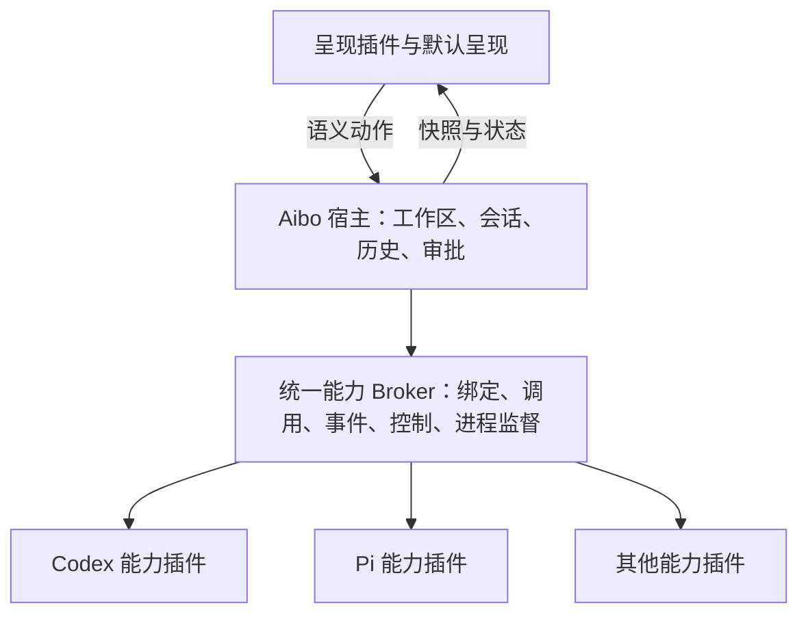

# 会话能力迁移

状态：迁移完成。协议、职责、旧执行路径退役、自动回归、原生桌面生命周期及 macOS 发布构建已核对。验证限制见下文。

## 目标与边界

Aibo 由插件宿主、能力插件和呈现插件组成。Codex/Pi 是能力提供者，其原生引擎属于插件
内部实现。会话仍是宿主业务模型，不再拥有独立 Agent 运行协议。用户接受旧会话只读，
本次不要求把旧原生恢复数据转换成新绑定。

## 职责与当前实现

| 职责 | 所有者与实现 |
| --- | --- |
| 运行协议 | Capability runtime 2.0/2.1 共用 PluginRuntime；2.1 增加 invocation 流和执行中控制 |
| 能力选择 | Broker 根据贡献、契约、作用域、精确安装版本绑定；不因安装新版本自动换绑 |
| 会话状态 | SessionHost 管理会话身份、轮次准入、归档、恢复入口和原生分支与宿主历史的对应关系 |
| 历史 | 宿主先持久化能力事件，再做会话事件投影；失败状态与事件同事务保存 |
| 原生执行 | Codex 插件持有 app-server；Pi 插件持有锁定 SDK。旧 Rust 原生管理器和 CLI RPC 备用实现已删除 |
| 权限 | 宿主确认可写 invocation；工具执行再次检查调用归属、代际、信任与 profile，呈现层不持有批准凭据 |
| 取消 | 同一调用所有者取消；命令走可取消进程执行。工具控制响应无法送达时取消调用，避免无限等待 |
| 恢复 | v2 binding 保存原生 recovery。恢复不重放未知副作用，持久化失败不伪造成功 |
| 呈现 | WorkbenchPresentation 和默认呈现消费宿主状态；旧 PluginView、view/render 与动作 IPC 已删除 |
| 历史兼容 | v1 清单只能识别元数据、不能启用；没有新绑定的旧会话拒绝发送和恢复，仍可读取与归档 |

核心合同：`contracts/session-capabilities.v1.json`、`session-event.v1.schema.json`、
`session-binding.v2.schema.json`、`capability-runtime.v2.1.schema.json`。
保留的 agent 命名、历史 SQL 表名和事件数据结构不代表仍支持旧执行协议。

## 会话调用并发

SessionHost 按会话串行协调恢复、普通能力调用及恢复状态持久化。创建、发送准入、
分支和关闭使用同一会话的协调入口，避免界面同时加载模型、命令与快照时争抢 Broker
的单调用槽。不同会话使用独立入口；等待者离开后释放对应锁资源。

运行中的控制请求直接使用所属轮次的控制通道，取消和工具审批不等待普通读取队列，
仍校验调用窗口与代际。Broker 的单调用限制保持不变，不自动重试写入或发送。
会话操作失败使用 `session_operation_error`，不再归类为应用初始化错误。

轮次区分启动、运行、收尾与结束，宿主保留轮次记录不代表 Broker 控制通道已经可用。
快照、模型列表、命令/技能等只读查询在轮次结束后重新取得会话准入；交互请求等待
通道就绪，收尾后拒绝执行，不跨轮次重放。Pi 时间线在运行期间由发送前的原生活跃
分支与本轮持久化消息组成，立即展示已接受的用户消息，不混入其他分支的历史。
前端以发送/入队确认作为草稿消费边界，后续刷新失败仅提示刷新问题，不再标记发送失败。
宿主回归通过固定启动与收尾边界验证上述行为，前端回归覆盖发送及入队后的刷新失败。

原生桌面探针同时覆盖并发读取模型、命令/技能及快照，并在两套皮肤中分别通过界面
新建 Pi/Codex 会话，以持久化能力事件确认自动加载成功且没有错误提示。

首条用户消息命名由宿主统一处理：创建与自动命名共享默认名称，后续消息不覆盖已有名称，
手动名称保持不变。Pi 与 Codex 的创建、发送路径均有回归覆盖。

## 会话权限确认

常规只读与需审批的工作区编辑不再逐条弹出整轮写入确认。宿主依据实际生效的文件、
命令与审批策略识别宽泛权限：完全文件访问、免审批写入或免审批命令执行。创建会话
直接选择这些权限，或在设置中扩大到这些权限时，确认一次；取消不会保存新配置。
权限范围内连续发送、模型切换与权限降低不重复确认。具体工具仍执行所选审批策略。

确认记录绑定会话、工作区及其信任代际、插件安装及启用代际和权限范围，不由呈现插件
声明。降低到常规权限会清除记录；插件重新启用或撤销工作区信任后需要重新确认。
升级前已有的宽泛权限会话没有确认记录，需在权限设置中重新选择权限后发送。

发送仍经过宿主写入账本、环境复核与取消机制。会话策略授权只适用于当前会话的顶层
`aibo.session.turn.write`，不能用于其他写入或传递给嵌套依赖调用。

## 功能保留与证据

| 功能/约束 | 验证入口 |
| --- | --- |
| SDK 流、控制、取消、事件边界 | `test/capability-interactive-runtime.test.mjs` 与 Broker/PluginRuntime Rust 测试 |
| Codex 文本、工具顺序、推理、模型、Skills、Goal、审批与提问 | `test/session-capability-providers.test.mjs`（真实能力进程、模拟原生引擎） |
| Codex 目录、快照、分支与原生边界 | 同上，以及 `session_host_tests.rs` 的分支回归；源绑定不被新分支替换 |
| Pi 队列、重试、压缩、树导航、结构化历史与恢复 | `test/pi-capability-workflow.test.mjs`；也以已安装的真实 SDK 创建/关闭无模型会话 |
| 实际文件写入审批、拒绝、跨窗口隔离、信任撤销与不重放 | `session_host_tests.rs` 的 write 回归 |
| 实际命令取消 | 同文件 Unix command 回归：观察命令启动，取消后验证后续 shell 命令不执行 |
| 旧执行路径不可恢复 | 同文件 retired 回归、插件清单退役检查及前端架构检查 |
| 呈现职责、皮肤边界与默认恢复 | `test/presentation-boundaries.test.mjs`、UI 架构检查与现有呈现回归 |

24 个无人调用的提供者专用 IPC 及 API 导出已删除。保留的线程目录、分支和树查询入口
传入实际窗口身份；SessionHost 不提供隐含 main 身份的执行便捷方法。

## 验证结果与限制

- `pnpm run verify`：架构、类型、Node 测试和前端生产构建通过。
- Rust 完整回归：195 项通过；进程清理测试在所需 ps 权限下运行。
- `pnpm run probe:session:desktop`：真实 WebView/Tauri、隔离应用数据和临时工作区；
  Pi/Codex 创建、快照、时间线读取、插件停用/启用后的恢复、关闭与两套皮肤工作台显示通过。
  成功记录：`/tmp/aibo-session-native-result.json`，应用标识
  `local.aibo.sessionprobe.1789221526940`。
- 未发送真实模型请求，未验证物理键盘或读屏；不能据此宣称联网模型完整功能等价。
- 当前原生 Codex 不支持请求附带轮次列表。元数据快照不依赖该操作，缺失的轮次统计为
  null，界面显示未知。分支仍要求原生边界可验证，不绕过检查。
- 第三方动态前端加载不在本次范围；默认/可信呈现合同保留。
- 旧 semantic-desktop 探针依赖已删除的命令入口，其历史结果不作为本次完成证据。

验证环境中 Vite 样式扫描可能撞上 Cargo 刚删除的临时目录，故前端验证与 Cargo 编译
顺序运行。全量 Node 验证使用临时 PATH 包装限制并发，未改变仓库脚本或测试断言。

完整批次、失败诊断和修复经过见 [历史实施记录](archive/capability-session-migration-history.md)。

发布检查已生成 `src-tauri/target/release/bundle/macos/Aibo.app`，资源目录仅包含锁定 Pi SDK
bundle 与应用图标，没有旧 Pi host。最终 SDK 核对补齐 handler 错误信封的 `data.kind`，
防止宿主把已知业务失败统一解释为传输不可用；专项 13 项通过，发布包已据此重建，宿主集成回归 5 项通过。

## 完成核对（2026-09-12）

| 要求 | 当前证据 | 结论 |
| --- | --- | --- |
| 唯一能力运行通道 | PluginRuntime 只接受 2.0/2.1；旧协议帧拒绝测试；AppState 共用 Broker | 已完成 |
| 内置引擎能力化 | 两个 v2 能力包、共享会话合同验证、真实进程工作流与桌面 IPC | 已完成 |
| 宿主职责归属 | SessionHost/Projection/Tools/Fork；实际写入、审批、取消、恢复与分支集成回归 | 已完成 |
| 旧数据只读 | v1 禁止启用、无新绑定拒绝执行、独立历史读取与归档回归 | 已完成 |
| 呈现边界 | WorkbenchPresentation、默认恢复与皮肤架构检查；旧视图合同/组件/IPC 删除 | 已完成 |
| 旧实现与兼容调用删除 | 旧 Host、原生管理器、内置执行包、24 个专用 IPC 和默认 main 调用删除；架构防回归 | 已完成 |
| 文档与 SDK | 当前说明、历史记录、支持矩阵、SDK 合同与错误信封说明 | 已完成 |
| 验证与构建 | 最终 verify：25 项架构、185 项 Node、类型与构建通过；Rust 全量 186 项，最终宿主专项 5 项；macOS app 构建成功 | 已完成 |

最终检查没有修改用户既有的 `.agents/` 或 `skills-lock.json`。
本次完成的是运行协议和职责迁移；上文列出的真实模型、原生接口和平台验证限制仍成立。
