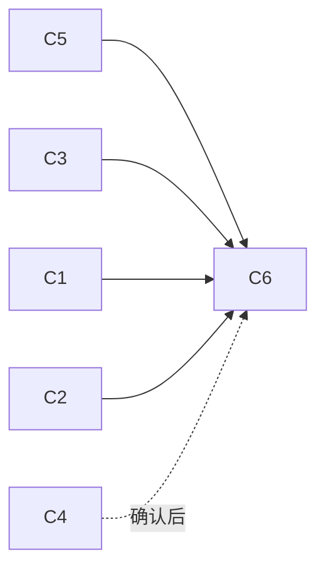

# 合同版本收敛：迁移计划

状态：提案，未实施。本文不改变现行支持范围；现行组合以
[插件平台支持矩阵](plugin-platform-support-matrix.md)为准。弃用与移除仍须遵守
[ADR-0005](adr/0005-plugin-protocol-stability-and-compatibility.md)：先发布弃用说明与迁移证据，再单独决定移除。

## 背景与问题

`contracts/` 目前有 30 个合同文件。同一合同族的多个版本同时存在，版本命名也不一致：

| 合同族 | 当前文件 | 实际状态（按代码引用核对） |
| --- | --- | --- |
| Capability runtime | `capability-runtime.experimental.schema.json`、`capability-runtime.v2.1.schema.json` | 2.0 与 2.1 均可执行（`plugin_manifest.rs` 接受 `2.0`/`2.1`）。2.0 的文件名是 `experimental`，但它是受支持的版本 |
| 插件清单 | `plugin-manifest.v1`、`plugin-manifest.v2` | v2 可执行；v1 只读元数据（`plugin_contract.rs`） |
| 语义视图 | `semantic-view.experimental-v1`、`v1`、`v1.1` | 三者都被默认 renderer 接受；宿主 Git 视图（`semantic_git.rs`）仍产出 experimental-v1 |
| 语义动作/提供者 | `semantic-action.experimental-v1`、`semantic-provider.experimental` | 代码无引用 |
| 旧 Agent 运行时 | `agent-runtime-protocol.v1`、`plugin-view-protocol.v1`、`plugin-session-binding.v1` | 执行已移除，仅测试引用：`test/plugin-contract.test.mjs`、`test/plugin-management.test.mjs`，`plugin-session-binding` 另见 `test/echo-plugin-process.test.mjs` |
| Agent 事件 | `agent-event.v1`、`agent-event.v2` | 仅测试引用；`agent_events` 表仍为持久化历史存储 |
| 会话 | `session-capabilities.v1`、`session-features.v1`、`session-event.v1`、`session-binding.v2`、`host-tools.v1` | 当前唯一版本 |

问题：

1. **版本扩散到内部。** 默认 renderer、`validation.ts`、`plugin-protocol/src/semantic.ts`
   都按 schema 字符串分支。每新增一个版本，消费者就多一个分支。
2. **文件名不表达状态。** `experimental` 既指仍在演进的合同（P1 语义切片），也指已稳定的 Runtime 2.0；
   新作者无法从目录判断该用哪个。
3. **历史合同与现行合同混放。** 只用于读旧数据的合同和可执行合同在同一目录，README 需要大段文字解释。

## 规则（本计划引入）

1. **每个合同族最多两个受支持版本**：一个**当前版本**（新产出只写它），一个**兼容读取版本**
   （只在边界读入并升级转换）。其余版本进入归档，除非有持久化数据依赖。
2. **边界编解码，内部单一模型。** 输入在宿主边界（插件 stdout、清单读取、数据库读取）升级到当前版本的内部模型。
   输出给外部接收方时，按对方声明支持的版本序列化（例如 Presentation 包的 `snapshotSchemas`）。
   内部模块不按版本分支。
3. **持久化格式与线协议分开判断。** 数据库中存在的格式，即使线协议已移除，也保留读取器和 schema，
   直到有迁移把旧行改写为当前格式，并通过[数据库迁移规则](database-migrations.md)验收。
4. **文件名表达状态**：`<name>.v<major>[.<minor>].schema.json`。实验合同放在 `contracts/experimental/`，
   历史合同放在 `contracts/archive/`。`$id` 不改，避免破坏外部引用；移动文件时在原位置保留一个 README 链接。

## 迁移项

### C1：语义视图收敛到 v1.1 + v1

| 步骤 | 内容 |
| --- | --- |
| 1 | 宿主 Git 视图改为产出 `aibo.semantic-view/v1`（或 v1.1，需要受控写动作时）。更新 `fixtures/semantic-git/*.json` 与 `semantic_git.rs` 的 schema 校验 |
| 2 | 在前端边界新增 `normalizeSemanticSnapshot()`：v1 → v1.1 内部模型（v1 没有写动作，升级时不增加动作）。默认 renderer 只处理内部模型 |
| 3 | 发送给外部 Presentation 包时，按其 `snapshotSchemas` 降级序列化；只声明 v1 的包不接收 v1.1 写动作，这与现行规则一致 |
| 4 | 从 `defaultPresentation.snapshotSchemas` 移除 `experimental-v1`，schema 移入 `contracts/archive/` |

前提：确认没有外部插件产出 experimental-v1。支持矩阵已写明语义贡献只接受 contract 1.0/1.1，
P1 切片也声明过它不是第三方 ABI。仍需搜索 `aibo-plugins` 与 fixtures 确认。

验收：`fixtures/semantic-git/` 的全部十个夹具（collection、detail、empty、error、loading、unavailable、partial，
以及 partial-detail、source-page、stale-action）在新 schema 下通过；
`test/presentation-semantic.test.mjs`、`presentation-git.test.mjs` 和完整外部皮肤探针通过；
外部 0.4.x 包无需重建。

### C2：Runtime 2.0 → 兼容读取，2.1 为当前版本

- 将 `capability-runtime.experimental.schema.json` 重命名为 `capability-runtime.v2.0.schema.json`（保留 `$id`）。
- `PluginRuntime` 内部只使用 2.1 语义：2.0 插件视为"没有 invocation 流与执行中控制"的 2.1 插件，
  由握手结果决定，不在调用路径中按版本分支。
- 新插件模板、开发指南和 `@aibo/capability-runtime` 默认生成 2.1 清单。
- 在发行说明中标记 2.0 弃用：列出影响（仍用 2.0 的插件）、替代方式（改用 2.1，清单改 `protocols.runtime`）
  和迁移证据（capability 示例插件改到 2.1 后的回归结果）。**移除 2.0 另行决策。**

影响：`plugin_manifest.rs:192`、`plugin_contract.rs`、`capability_broker.rs`、`examples/capability-plugin`、
`aibo-plugins/plugins/capability`、[插件开发指引](plugin-development_zh.md)。

### C3：归档旧 Agent 运行时合同

`agent-runtime-protocol.v1`、`plugin-view-protocol.v1`、`plugin-session-binding.v1` 移入 `contracts/archive/`。
`test/plugin-contract.test.mjs` 改为从归档路径读取，继续校验旧清单只读识别。

`plugin-manifest.v1` **保留在主目录**，作为清单族的兼容读取版本：宿主仍需识别 v1 清单并显示"不可启用"。

### C4：Agent 事件格式先确认再处理

`agent_events` 表仍在使用。处理前必须确认：

1. 表中 `payload_json` 实际存在哪些格式：session-event v1、agent-event v2，还是更早的 v1？
   用 `migration-history` 中的历史库夹具统计。
2. 历史投影读取路径是否依赖 agent-event v2 结构。

确认后二选一：

- **有旧格式行**：agent-event v2 作为兼容读取版本，v1 归档；新增读取适配，升级到 session-event 内部模型。
  是否改写旧行由单独的数据库迁移决定。
- **无旧格式行**：两者都归档，只保留测试夹具。

在确认前不移动这两个文件。

### C5：清理无引用的实验合同

`semantic-action.experimental-v1`、`semantic-provider.experimental` 在代码中无引用。
移入 `contracts/archive/`，并在 [归档索引](archive/README.md) 注明对应的 P1 切片文档。

### C6：目录与文档

- `contracts/README.md` 改为三段：当前合同（每族一行，标注当前版本与兼容读取版本）、实验合同、归档合同。
- 支持矩阵增加"兼容读取"列。
- 新增边界测试：`src/lib/`（边界编解码模块除外）与 `src-tauri/src/` 的业务模块中不得出现
  `semantic-view/experimental`、`runtime.*2\.0` 等版本字面量。

## 顺序与依赖

C3、C5 风险最低，可以先做。C1 需要改宿主 Git 视图，C2 需要发布弃用说明，两者可并行。
C4 必须先完成数据盘点。

## 风险与缓解

| 风险 | 缓解 |
| --- | --- |
| 外部作者按旧路径引用 schema 文件 | `$id` 不变；原路径保留指向新位置的说明 |
| 边界升级转换有损（例如 v1 快照缺少字段） | 升级只做确定性映射，缺失字段使用合同定义的默认值；每个版本对各保留一组往返夹具 |
| 历史会话因归档读取器而无法显示 | C4 以数据盘点为前提；归档只移动 schema 文件，不删除读取器 |

## 验证

每项完成后运行 `pnpm run verify`。C1、C2 涉及 Rust 校验，还需要运行 `cargo test`（`src-tauri`）。
C2 需要用 `aibo-plugins` 的 `pnpm run verify` 验证外部插件仍可构建和握手。
