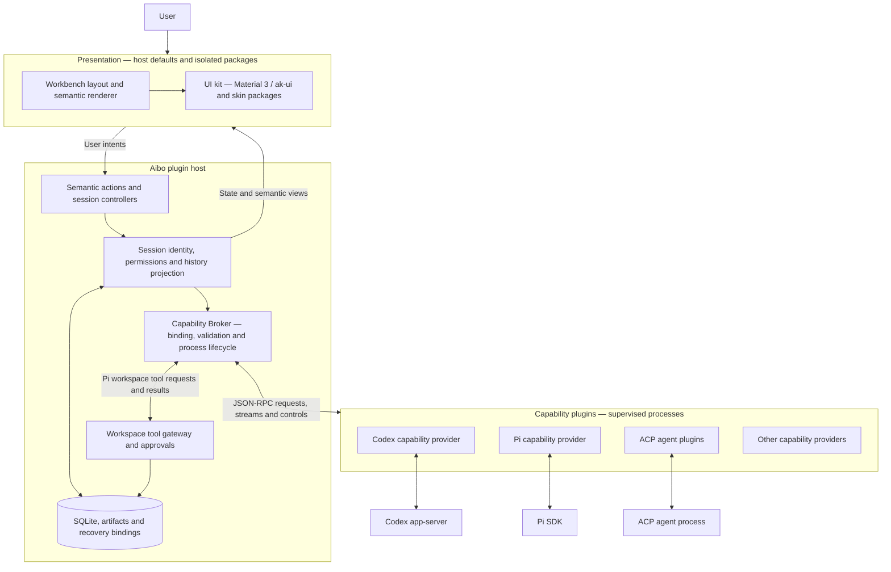

# Develop Aibo

[Back to Aibo](../README.md) · [Documentation](README.md) · [Contributing](../CONTRIBUTING.md)

For your first conversation, use the [getting-started guide](getting-started.md).
This page describes the application architecture and contributor workflow.

## Run and build

Install Node.js 22+, pnpm, Rust, and the platform build dependencies for Tauri 2.
From the repository root:

```sh
pnpm install
pnpm tauri dev
```

`pnpm dev` starts the browser UI preview; native agent execution requires Tauri.
`pnpm tauri build` builds desktop bundles. Development/debug builds use a separate
`development/` app data directory; see [database isolation](database-migrations.md).
Release bundles do not include Node. The installed app resolves a local runtime or lets the
user select/download one in settings; see [the host SDK guide](host-sdk.md).

## Architecture



The host owns business state and authorization. Capability plugins implement operations
and native-engine integration. Presentation plugins decide how information and actions
are arranged and rendered; they do not grant permissions or execute business operations directly.
Native-engine enforcement and the host tool gateway are distinct boundaries: workspace
trust alone is not an operating-system sandbox.

A message travels from the composer through the host's session admission and Broker to
its pinned provider. Validated events update host history and flow back to the presentation.
The host keeps history readable when a provider is unavailable. Pi's active timeline combines
its native branch with persisted messages from the current turn.

**Current extension boundary:** capability and presentation packages can be installed locally
through separate installation paths. External presentation code runs in a terminable Worker
and returns a restricted visual tree, drawn by a trusted iframe bridge. It has no direct DOM,
network, storage or Tauri IPC access. The host retains management and recovery; Agent approvals
render in their session area and the host revalidates every choice. Unprovided presentation
surfaces inherit the host defaults. The old Agent Runtime v1 is
retired, and sessions without current capability bindings remain read-only history.

## Extension development

Start with the [English plugin guide](plugin-development.md) or [中文指引](plugin-development_zh.md).
External integrations and templates live in [aibo-plugins](https://github.com/chldu2000/aibo-plugins).

| Resource | Purpose |
| --- | --- |
| [Capability example](../examples/capability-plugin/) | Standalone TypeScript provider with a semantic view |
| [Plugin protocol](../packages/plugin-protocol/) | Framework-independent data contracts |
| [Capability runtime](../packages/capability-runtime/) | Node stdio runtime helper, including streaming and controls |
| [Web presentation types](../packages/web-presentation/) | Local interface for trusted presentation implementations |
| [Host SDK](host-sdk.md) | Host-provided runtime modules, version ranges and Node resolution |
| [ACP adapter](../packages/acp-adapter/) | Generic ACP client and Worker for agent plugins |
| [Presentation packages](presentation-package.md) | Isolated package contract, Worker entry and build tools |
| [UI architecture](ui-architecture.md) | UI kit boundaries and skin extension rules |

The runtime SDK version in this checkout is recorded in
[`packages/plugin-host/sdk.json`](../packages/plugin-host/sdk.json); recorded published snapshots
are in [`sdk-releases.json`](../packages/plugin-host/sdk-releases.json). Source and published
versions can differ. The [SDK guide](host-sdk.md) explains packaging and version boundaries.

For installable skins, see the [shadcn](../packages/presentation-shadcn/README.md) and
[Material 3](../packages/presentation-material3/README.md) package guides. Current contracts
live in [presentation-package.md](presentation-package.md); historical delivery evidence is
kept in the [release guide](presentation-release-0.3.0.md) and [exit audit](presentation-plugin-exit-audit.md).

## Verification

Read the applicable contracts in [AGENTS.md](../AGENTS.md) before editing. From the repository root:

```sh
pnpm run verify
```

This checks migrations, SDK release consistency, architecture, TypeScript, Node tests, and the frontend build.
It does not run Rust tests or browser/native probes. For changes that affect those paths, follow
[the regression matrix](plugin-boundaries-and-regression.md#regression-gate). Documentation-only
changes also need link checks, but no unrelated runtime probes.

Useful targeted checks, when required by the changed behavior:

```sh
cargo test --manifest-path src-tauri/Cargo.toml
pnpm run probe:session:capabilities
pnpm run probe:session:desktop
pnpm probe:codex
pnpm probe:pi:sdk
```

Real-model probes are separate and require credentials. See [native engine probes](native-engine-probes.md)
for setup, executable overrides, approvals, and output locations. Raw results under `.aibo/probe/runs/`
may contain local metadata; only commit redacted summaries or fixtures.

## Repository map

| Directory | Contents |
| --- | --- |
| `src-tauri/src/` | Rust host, Broker, session lifecycle, permissions and persistence |
| `src-tauri/capability-plugins/` | Built-in Codex and Pi capability packages |
| `src/lib/app/` | Frontend business controllers |
| `src/lib/workbench/`, `src/lib/ui-kit/` | Presentation integration and visual adapters |
| `contracts/`, `packages/` | Versioned schemas and local SDKs |
| `examples/`, `fixtures/`, `test/`, `probes/` | Examples, test providers and validation tools |
