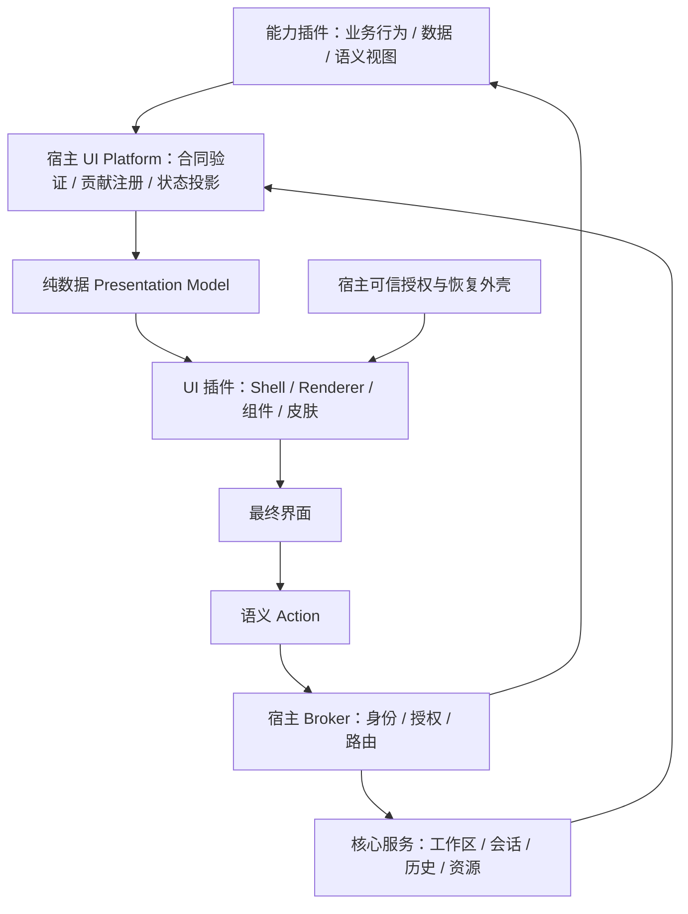

# Aibo 向插件宿主、能力插件与 UI 插件演进

> 日期：2026-09-10 · 状态：架构演进提案；P0/P1/P2 已实施，后续阶段仍待实施，本文不替代现行契约。
>
> 输入：[讨论原文](./discuss-with-gpt.md)的三轮讨论，以及当前仓库代码。本次修订将重点从“通用能力插件与可插拔面板”调整为“业务语义与整个表现层解耦”；框架无关是目标性质，当前实现仍是 Svelte。

2026-09-11 实施进度：[P1 Git 只读语义切片](./plugin-platform-p1-semantic-slice.md)已通过自动检查、四组合浏览器与原生 WebView 脚本验收；[P2](./plugin-platform-p2-agent-state.md) 已完成统一 Agent 路由、宿主状态、整窗呈现切换及失败恢复，并通过真实 Codex/Pi、应用重启和窗口隔离验收；详细范围见 [P2 退出矩阵](./baselines/plugin-platform-p2/completion-matrix.md)。

### 已确认的实施决策（2026-09-10）

第二轮已确认状态恢复、动作执行、异步结果、过期动作、交互一致性及大数据呈现原则，详见[语义交互与状态规则](./plugin-platform-interaction-decisions.md)与 [ADR-0006](./adr/0006-presentation-state-and-result-ownership.md)。这些是后续实施约束，尚未改变现行运行行为。

下列决定已确认，但尚待实施，不改变现行 schema 或 UI 规则。其余设计草案仍需按阶段细化；执行入口见[实施 checklist](./plugin-platform-implementation-checklist.md)，术语见[领域词汇表](../CONTEXT.md)。

| 决策 | 结论与原因 | 记录 |
| --- | --- | --- |
| 首次交付边界 | P3 是首次平台交付门：承诺能力包与声明式贡献可安装。P1 验证语义边界，P4 验收完整 Presentation Plugin；分别验收可替换性与独立安装，避免扩大首版承诺 | [实施约定](./plugin-platform-implementation-checklist.md#执行约定) |
| 契约治理 | 插件可定义自身命名空间能力契约，核心语义视图由宿主治理；兼顾业务扩展与 renderer 可替换性 | [ADR-0002](./adr/0002-capability-and-semantic-contract-governance.md) |
| 动作责任 | 分为本地交互、宿主导航和能力调用；使业务意图与物理布局解耦，同时保留导航恢复能力 | [ADR-0003](./adr/0003-semantic-action-responsibilities.md) |
| 运行隔离 | scope 不等于进程拓扑；首版 workspace 能力默认按工作区隔离实例，以资源开销换取故障/取消边界清晰 | [ADR-0004](./adr/0004-workspace-capability-runtime-isolation.md) |
| 兼容政策 | P1 语义协议实验性，P3 发布前冻结稳定版；演进期间保留 v1，退出执行兼容单独决策，避免内部重构破坏外部插件 | [ADR-0005](./adr/0005-plugin-protocol-stability-and-compatibility.md) |

## 1. 建议与目标

Aibo 应沿用现有进程外插件路线，逐步成为**带有默认 Agent 工作台的插件宿主**：宿主管理身份、授权、运行、数据，以及 UI 语义与交互合同；能力插件提供行为、数据和语义视图；UI 插件实现布局、组件与渲染。现有 Codex、Pi、工作区工具和工作台成为首批实现与验证对象。

这不是从零搭建插件系统。Aibo 已经拥有 Registry、Runtime、Agent 协议、声明式 PluginView 和可替换 UI Kit。真正需要补齐的是：

1. 能力 SDK 只出现可序列化的业务数据、command 和语义视图，不出现 Svelte、DOM、CSS 或具体组件类型。
2. UI 插件可以改变导航位置、页面布局和组件形态，不要求能力插件重写视图。
3. 宿主统一定义焦点、键盘、可访问性、生命周期和扩展点合同；UI 实现不能自行改变业务操作语义。
4. 内置与外部能力走相同调用路径，并逐步支持无需 Agent session 的工作区/应用能力。
5. 不同工作台、皮肤乃至框架实现消费同一份业务模型；换 UI 不重建会话。

建议先保持单仓库和现有构建方式，以运行边界、契约和验收证明拆分有效，再决定独立包发布。文件拆成多个目录不等于完成插件化。

### 1.1 对讨论结论的取舍

采用讨论中的核心原则：**宿主定义 UI 语义与交互合同，UI 插件定义表现，能力插件贡献业务语义。** token 是实现工具，不能单独保证布局、操作和可访问性一致。

需要修正初稿的三点：能力包可以直接声明它新增的页面，不必先写一个独立面板插件；UI 插件应有权重排整个工作台，不能只替换组件颜色；新的 View 协议应提升到表单、集合、详情等业务语义，不能继续把 row/grid 树扩展成自造的前端框架。

讨论中的 Core + Optional + Fallback 值得采用，但属于未来契约演进，不能立即把现有必需 `UiKitAdapter` 成员改成可选。Custom Surface 则保留为有明确隔离和兼容限制的扩展方向。跨框架先验证边界，不把多框架同时混装设成第一阶段产品要求。

## 2. 当前架构与差距

以下判断以源码为准；较早的阶段文档描述的是当时状态，不能直接作为当前缺陷清单。

| 当前落点 | 已有基础 | 需要演进的地方 |
| --- | --- | --- |
| [`plugin_registry.rs`](../src-tauri/src/plugin_registry.rs)、[`plugin_runtime.rs`](../src-tauri/src/plugin_runtime.rs) | 安装、release、进程及协议边界 | 复用这些机制，支持非 Agent contribution，避免创建第二个插件管理器 |
| [`plugin_host.rs`](../src-tauri/src/plugin_host.rs) | 会话创建/恢复、capability 调用、事件投影、工具代理、view action 验证 | `invoke_capability` 要求 session；宿主还含 Pi/Codex 专用恢复与装配逻辑，需要分离通用机制和兼容逻辑 |
| [`plugin-manifest.v1`](../contracts/plugin-manifest.v1.schema.json) | manifest、权限、Agent operations 和资源声明 | 要求 `entrypoint` 和非空 `agents`，不能直接表达纯 UI 包或无会话的能力包 |
| [`api.ts`](../src/lib/api.ts) | 已有 `createAgentSession`、`invokeAgentCapability` 等统一入口 | Codex/Pi 专属入口仍与统一 API 并存，需要逐项核对调用链后收敛 |
| [`agent-kind.ts`](../src/lib/app/agent-kind.ts) | 集中了部分 Agent 差异判断 | 会由 ID、`session.tree`、`queue.manage` 推断 Pi 家族；新 Agent 具备队列能力不应该因此走 Pi API |
| [`App.svelte`](../src/App.svelte) | 页面装配、控制器注入、插件面板 | 仍保存独立插件列表、选择、草稿和时间线状态，尚未形成统一工作台贡献模型 |
| [`UiKitAdapter`](../src/lib/ui-kit/contract.ts)、[`registry.ts`](../src/lib/ui-kit/registry.ts) | 两套皮肤与语义复合组件 | 契约包含 Svelte `Component`，是框架内适配器；不能直接作为跨框架插件公共 ABI |
| [`PluginView v1`](../contracts/plugin-view-protocol.v1.schema.json) | 声明式节点、binding、action、资源和 revision | 围绕 session 的 row/grid 等控件树虽是 JSON，却已固定很多布局；需增加高层语义视图，而非只增加节点 |
| [`lib.rs`](../src-tauri/src/lib.rs) | 工作区、Git、附件、项目命令、会话等实际功能 | IPC、领域服务和执行细节集中，应先提取可测试模块，再选择适合进程外运行的能力 |

特别注意：当前 Pi manifest 已声明 SDK、队列、审批和 session tree 等能力，Host 也有工具处理代码。因此不能直接把早期 Pi 插件审计里的能力缺失当成当前事实。能力等价仍需测试和真实运行验证。

## 3. 三类职责与边界



能力插件不依赖 UI 插件，双方依赖宿主合同。UI Platform 是逻辑职责，不要求另起进程；宿主负责验证和调度，具体渲染属于 Presentation Adapter。图中的交互不传递 Rust 对象、数据库或组件句柄。

### 3.1 插件宿主：管理机制与权威状态

宿主保留以下职责：

- Registry、包完整性验证、兼容检查、启停、release 固定和依赖解析。
- 进程监督、generation、超时、取消、资源限制和故障归因。
- capability 发现、调用路由、权限解析、审批与审计。
- workspace/session/turn 等 Aibo 身份，以及核心生命周期和历史投影。
- SQLite 核心迁移、受控附件和 artifact 引用、插件命名空间存储。
- 声明式视图验证、扩展点管理、皮肤选择与安全恢复外壳。

初期保留 Agent session 模型作为宿主内建领域服务。Aibo 的价值本来就包括持久会话与统一历史，无需为了“通用”马上把这些权威数据也迁出。以后若出现真正不同的产品形态，再评估领域服务模块化。

判断某个功能是否留在宿主的原则：**它是否必须对所有插件一致执行，或者在所有插件停用时仍然成立？** 授权、历史读取和故障恢复通常需要；模型目录翻译和 Git 分支查询通常不需要。

### 3.2 能力插件：提供可调用的领域行为

能力插件拥有 Provider 协议、业务算法、版本化恢复数据和专用缓存，不拥有 Aibo 核心表或最终授权决定。

| 候选能力插件 | 提供行为 | 宿主仍然负责 |
| --- | --- | --- |
| Codex / Pi | 原生会话操作、流式协议翻译、模型与专有能力 | Aibo session、授权策略、投影、进程代际 |
| Git | 状态、diff、分支、提交与同步语义 | 工作区身份、写入/执行授权、结果审计 |
| 项目任务 | 任务发现、运行配置、结果解析 | 进程执行策略、取消、日志与 artifact 存储 |
| 搜索 / 索引 | 检索算法、索引更新、命中结果 | 数据范围、资源访问、索引命名空间 |
| 上下文交接 | 摘要与交接编排 | 来源证据、附件授权、版本化 envelope 和持久化 |

Agent 是能力插件的一种。不要要求 Git status 或搜索索引创建一个假的 Agent session。

业务逻辑成为插件不意味着把权限执行点搬进插件。例如 Git 插件可以组织命令，但工作区限制、执行批准和输出限制仍在宿主的受控执行接口执行。

### 3.3 UI 插件：拥有表现层，遵守宿主交互合同

建议把 UI 插件理解为 **Presentation Plugin**，内部可以组合三个实现角色；不强制拆成三个安装包。

| 实现角色 | 拥有的决策 | 不得改变的内容 |
| --- | --- | --- |
| Shell / Layout | 三栏或单栏、导航位置、面板与工具栏布局、响应式呈现 | 注册贡献的业务含义、授权与恢复入口的可达性 |
| Semantic Renderer | 把集合画成表格或卡片，把表单画成分组页或纵向表单 | 字段类型、校验规则、action ID、必需信息与状态 |
| Skin / Components | token、图标、形状、动效及符合合同的具体交互实现 | disabled/loading 语义、键盘操作、焦点与可访问性要求 |

当前默认工作台、PluginView Renderer、shadcn/Material 3 是这些角色的初始实现。两套皮肤只证明框架内组件可替换，尚未证明整个 UI 可替换。

能力包可以携带 `settings`、`collection`、`detail` 等语义视图声明；它声明“有什么界面”，UI 插件决定“如何呈现”。独立的视图组合包可以组合多个能力，但也只产生语义描述，不应成为另一套任意布局代码。初稿中的“独立 Git UI 包”因此应明确为 Git 语义贡献包，不能与负责渲染所有能力的 UI 插件混为一谈。

### 3.4 Host-owned Chrome：控制权属于宿主，外观交给 UI

宿主定义页面标题、导航、工具栏、菜单、滚动容器的语义与生命周期；UI 插件决定其位置、尺寸、外观与响应式布局。能力仅提供标题、语义图标、动作和内容。宿主拥有 chrome 不等于宿主硬编码一套三栏布局。

例如能力注册 `workspace.tool`，Shell 可以把它放入侧栏、顶部导航或命令入口。稳定扩展点应表达用途；`sidebar.item` 这类物理位置可以是某个 Shell 的内部映射，但不应成为所有能力必须依赖的公共契约。缺少常驻位置时，标准贡献仍须能通过通用导航或命令入口访问；不得静默消失。

窗口控制、可信审批及故障恢复仍由宿主掌握。UI 插件能按合同呈现普通 chrome，不能伪造授权结果或取代可信审批面。业务校验属于能力/领域层，通用键盘和焦点规则属于 UI Platform，具体 DOM 与无障碍实现由 renderer 承担并接受合同测试。

## 4. 需要新增的核心契约

本节名称与结构均为设计草案，当前宿主尚不支持。现行 v1 schema 不应通过放宽验证来接受这些字段。

### 4.1 Manifest v2：从 Agent 清单到 contribution 清单

建议 manifest v2 增加 `contributions`，至少区分 `agent`、`capabilityProvider`、`semanticView`，并定义 UI 插件的 `presentation` 描述（Shell、renderer 协议、支持的语义视图版本与可选呈现能力）。纯声明式包可以没有可执行入口；有运行逻辑的包才要求 runtime entrypoint。

同时区分：宿主版本范围、协议版本范围、capability 契约版本、包依赖、本机可执行依赖、可选 UI contribution。当前 v1 的 `dependencies` 是本机依赖，不能静默改成插件依赖。

一个 Git 能力声明的概念示例：

```json
{
  "id": "dev.aibo.git.status-provider",
  "kind": "capabilityProvider",
  "provides": [{ "contract": "aibo.git.status", "version": "1.0" }],
  "scope": "workspace",
  "operation": "ext.dev.aibo.git.status",
  "effects": "read",
  "requiredPermissions": ["workspace.read"]
}
```

这只是 contribution 片段，不是可安装 manifest。最终 schema 还必须定义字段限额、输入输出 schema、运行时映射及错误语义。

### 4.2 Capability Broker：按契约和作用域路由

每项能力至少描述：契约 ID/版本、提供者身份、输入输出 schema、作用域、读写效果、权限、并发规则、超时/取消及幂等要求。

建议先支持 `application`、`workspace`、`session` 三种作用域；turn 是调用上下文，有需要时再独立建模。带工作区的调用由宿主从身份解析真实路径，不能相信 UI 或插件传来的绝对路径。

调用链必须统一：

1. UI action 或另一个插件提交受限调用请求。
2. 宿主根据已绑定提供者和契约版本解析目标；验证调用者身份与作用域。
3. 校验输入、manifest 声明、运行时协商结果和当前可用状态。
4. 解析权限与审批、检查资源和并发约束，启动或复用目标 runtime。
5. 绑定 invocation ID、release、generation、deadline 后派发。
6. 校验输出并记录必要事件，向调用者返回规范结果。

多个提供者实现同一契约时，已有 session 使用固定绑定；workspace/application 使用显式配置。没有配置且存在歧义时返回 `provider_selection_required`，不能按安装顺序随机选择。提供者失效也不能静默把写操作转交另一个实现。

错误至少区分 `unsupported`、`incompatible_version`、`permission_denied`、`provider_unavailable`、`busy`、`cancelled`、`timeout` 和 `invalid_output`。进程在写入后断开时，结果可能未知；没有幂等契约不得自动重试。

capability 表示“能做什么”，permission 表示“当前允许访问什么”，两者必须分开。支持命令执行不代表已获准执行任意命令，插件声称支持原生沙箱也不能直接作为宿主信任依据。

### 4.3 插件间调用和依赖

插件之间通过 Broker 调用，不直接 import 实现、不共享 SQLite、不自行连接对方进程。宿主传播原始调用者、资源范围、调用链和 deadline；权限按调用链约束取交集，不能借用被调用插件更大的权限。

初版仅支持明确声明的依赖，解析后固定 release，拒绝必需依赖环；可选依赖缺失只禁用相关 contribution。调用深度和并发有界，取消向子调用传播。

暂不设计通用工作流语言、任意事件订阅或远程插件协议。先用“Git UI → Git capability”和“项目任务 → 受控执行服务”证明跨边界调用确有价值。

### 4.4 Contribution 与 Semantic View：描述用途和业务结构

第一批公共扩展点建议为 `workspace.tool`、`session.context`、`session.action`、`settings.page` 和 `command`。它们分别定义上下文 schema、贡献数量、排序意图、适用条件、空态与卸载行为；UI 插件映射到自己的物理布局。未登记扩展点拒绝注册，可选贡献不兼容时须给出诊断。

建议为新语义视图定义独立的版本化合同，与 `PluginView v1` 并存，避免把所有历史 row/grid 文档直接解释为新的高层模型。第一版只做 `settings`、`collection`、`detail`、`inspector`，按实际需求补 `wizard`。列表列描述数据属性，字段描述类型和校验，action 描述意图与输入；不出现 px、class、CSS token、DOM 属性、脚本、任意表达式或绝对位置。

下面是 Git 贡献的概念片段，并非当前可安装包：

```json
{
  "id": "dev.aibo.git.changes",
  "extensionPoint": "workspace.tool",
  "title": "工作区变更",
  "view": {
    "kind": "collection",
    "itemKey": "path",
    "properties": [
      { "key": "path", "type": "text", "label": "文件" },
      { "key": "status", "type": "enum", "label": "状态" }
    ],
    "dataSource": { "capability": "aibo.git.status", "version": "1.0" },
    "actions": [
      { "id": "open-diff", "intent": "inspect", "selection": "single" }
    ]
  }
}
```

完整协议还需声明 `open-diff` 到受控 operation 的映射、枚举取值、输入输出 schema、数据量上限和分页。这里只展示：同一份贡献可以呈现为侧栏文件列表、中央表格或窄屏卡片，无需能力作者提交三种控件树。

可见性采用有限的上下文/能力条件，业务复杂条件由能力计算成状态，不能发展为表达式语言。加载、空、错误、分页、selection 和 validation 使用标准数据结构。流式消息使用现有事件投影和有界批量更新，不要求每个 token 重发整棵页面树；也不在第一版发明任意节点 patch 引擎。

宿主在 action 提交时再验证上下文、revision、generation 和权限，renderer 不直接选择任意 IPC method。当前 Host 对非 `never` 的 view confirmation 返回未实现，必须补齐宿主确认闭环，不能把显示按钮视为实现审批。

### 4.5 公共数据协议与 Renderer Adapter 分开

**Capability SDK 和 Presentation Model 中都不出现 Svelte `Component`、ReactNode、VNode、HTMLElement、CSSProperties 或函数回调。** 跨边界传的是版本化 JSON、稳定 ID 和语义动作消息。

renderer 的平台内适配接口可以有 DOM 类型，但应放在仅供可信 Web renderer 使用的独立包，不能从能力 SDK 重导出。概念接口如下：

```ts
// 仅 Web renderer 的本地适配层；不是能力插件的 wire protocol。
interface WebPresentationAdapter {
  mount(target: HTMLElement, initial: PresentationSnapshot,
        channel: PresentationChannel): Promise<MountedPresentation>;
}
interface MountedPresentation {
  update(next: PresentationSnapshot): void;
  dispose(): Promise<void>;
}
```

`PresentationSnapshot` 是可序列化数据；channel 的方法只是受限语义消息桥，不暴露 shell、通用 Tauri invoke 或数据库。桌面本地适配层可以依赖 DOM，未来 native/CLI 则使用各自挂载接口，复用上层数据协议。这里的 ABI 指版本化互操作合同，不是承诺 JS/Rust 二进制 ABI。

首个实现是 `SveltePresentationAdapter`，内部继续使用 `$lib/ui-kit`。以后新增框架时，在清晰的渲染根上 mount/update/dispose，不让 React/Vue 组件逐个混入 Svelte 组件树。默认一个窗口使用一套主 renderer；弹层也属于它的受控渲染根。

切换流程为：保存可序列化的草稿/选择/焦点语义目标 → 预检新 renderer 合同 → 解除旧订阅并 dispose → 挂载新 renderer → 恢复状态。挂载失败回到默认 renderer，旧实例的迟到消息由 presentation generation 丢弃。切换不重启 Agent，不清空未完成 turn；DOM 焦点节点不能跨框架保存，应保存字段或 action ID。

“框架无关”的验收必须包含第二个最小 renderer（例如无框架 DOM 实现）消费相同 fixture、发送相同 action。无需立刻维护另一套完整产品 UI。Web/移动端/CLI 的可复用性只针对语义模型，不能由此推断本机进程、路径、认证和执行能力也已跨平台。

### 4.6 Core + Optional + Fallback

长期 UI 合同分成：所有 renderer 必须支持的核心语义视图与交互；可选的 DataGrid、CommitGraph 等专业呈现；宿主规定的兼容降级语义。renderer 声明版本化支持表，宿主解析能力要求，业务代码不检测皮肤 ID。

选择顺序是：兼容的专业呈现 → 用当前 renderer 核心语义表达的 fallback → 明确的不可用说明。fallback 不能偷偷嵌入 shadcn/Svelte 专属组件；例如 CommitGraph 可以降为带父提交关系的列表，不能把必须依赖图操作的编辑功能假装成等价。必需呈现语义无法保留时拒绝启用该贡献，可选增强缺失只降级该区域。

这不要求所有主题预先实现每个新控件，也不允许能力作者私自定义通用控件。业务数据、校验和选择规则可复用；布局算法、DOM 和视觉实现属于 renderer。复杂时间线与 Composer 先作为可信专业呈现保留，不急于改成通用 DSL。

现行 `UiKitAdapter` 仍保持必需成员及全皮肤实现规则。引入 optional 能力前，应单独提交 ADR，同步 contract、架构测试与 `ui-architecture.md`，将稳定 Core、optional 协商和 fallback 验收写进新规则。本文不授权跳过现行检查。

## 5. 加载与安全模型

保留 [ADR-0001](adr/0001-process-isolated-agent-plugins.md) 的原则：能力插件进程外运行；第三方 UI 不向主 WebView 注入 HTML、CSS、JS 或 Svelte 代码。进程隔离提供故障边界，不等于操作系统沙箱。

初期的加载矩阵：

| 内容 | 能否运行时安装 | 信任与隔离 |
| --- | --- | --- |
| 进程外能力插件 | 可以，沿用并扩展 Registry | 明确本机权限模型；宿主代理接口有强制校验，但不能据此声称限制了进程全部系统访问 |
| 声明式 UI contribution | 可以，在协议扩展后 | schema、资源摘要、action 和上下文全部由宿主验证 |
| 内置工作台 Svelte 模块 | 随应用构建 | 可信代码，仍遵守 app / ui-kit / business 边界 |
| 具体组件库与皮肤实现 | 先随应用构建 | 不加载第三方远程脚本或任意全局 CSS |

如果以后确需第三方任意前端代码，必须另立 ADR，设计独立 WebView/origin、受限消息桥、CSP 和无直接 Tauri 权限的边界，再验证支持平台。不能把动态 import 当作 UI 插件协议。

### 5.1 Custom Surface 的有限逃生口

讨论中的自由度阶梯适合 Aibo，但不同层级不具有相同的兼容保证：

| 层级 | 适用场景 | 保证与限制 |
| --- | --- | --- |
| Contribution | 导航、命令、设置入口 | 完全由当前 UI 呈现 |
| Semantic View | 表单、集合、详情 | 能力只交数据，renderer 保证标准交互与外观 |
| Components / Primitives | 可信的编辑器、时间线等专业呈现 | 属于 renderer 内部 SDK，可能绑定框架；不得作为能力 SDK 的捷径 |
| Custom Surface | 难以标准化的图、终端、画布 | 限定区域内自由呈现，仅保证外围 chrome 和主题信号；不承诺像素或交互完全一致 |

Custom Surface 暂不作为现行第三方插件可用接口。未来接入需声明所需桥接权限、运行环境、输入与动作合同、主题响应和无障碍替代视图。宿主提供标准 chrome、尺寸、主题版本、语义 token、color scheme 与 reduced-motion 等信号；隔离区域使用局部 CSS，不能改宿主导航和全局样式。`usesTokens: true` 只是声明，必须用实际主题切换和交互检查验证。

Shadow DOM/scoped CSS 仅隔离样式，不是运行不可信脚本的安全边界。第三方可执行 UI 需评估独立 WebView/origin 或受限 iframe 及消息桥；容器本身也不自动解决系统权限和资源配额。ADR 必须覆盖 CSP、导航/网络、弹窗、剪贴板、拖放、消息来源与限流，以及键盘、焦点和可访问性，再决定支持范围。可信内置专业 renderer 无需仅为了换主题就套 iframe。

普通能力插件仍无 CSS/token/DOM 接口；需要自定义实现时注册为单独的受限 presentation contribution，使权限与框架依赖显式可见。没有兼容 surface 的 UI 应展示语义 fallback 或明确不可用，不能导致整个工作台加载失败。

无论装了什么 UI，宿主必须始终可打开插件管理、查看授权和历史、停用故障插件并恢复默认工作台；插件不能替换或遮蔽这些恢复入口和可信授权界面。

## 6. 生命周期、数据与兼容性

安装与激活分开：先验证包、契约和依赖，再启用 contribution；按实际作用域懒启动能力 runtime。无 session 的插件用 instance ID 和 generation 监管，不伪造 session binding。

升级产生不可变的新 release。活动 session、invocation 和相关依赖保留原绑定，新启动使用兼容的新 release。旧包只有在没有活动引用且不影响恢复策略时才能回收；禁用首先停止新调用，再有界取消/排空既有调用。卸载保留 Aibo 历史，单独处理用户明确选择的数据清理。

数据分为三类：

- **核心事实**：workspace、session、turn、审批、artifact 元数据与规范事件，由宿主迁移和写入。
- **插件私有数据**：索引、缓存和恢复数据，放在 release 包外的插件命名空间，记录格式版本与所有者。
- **UI 状态**：布局、草稿、展开项等由宿主按 contribution 作用域保存，不成为能力执行的权威数据。草稿、选择与可序列化导航状态跨 renderer 共享；DOM 引用、动画中间态和组件实例仅属于当前 renderer。

新能力事件使用独立且版本化的契约。Git 查询不能伪装为 AgentEvent；与 turn 相关的执行结果可通过关联 ID 连接到时间线。现有 AgentEvent v1/v2 与旧历史继续可读。

先通过 v1 compatibility adapter 把旧 `agents` 映射为新内部 contribution 描述，保持 v1 wire protocol 原样。新 manifest/runtime/view 协议分别协商版本；不兼容包在激活前明确拒绝。现有 session ID 不变，旧 binding 只有经过显式、可验证的迁移才改写；失败时继续读取历史并提供恢复诊断。

代码回滚和数据回滚必须分开。新插件写入的私有数据不保证旧版本可读；先采用可并存版本或迁移前备份，迁移失败不切换绑定。核心数据库优先用增量迁移，不能把删除旧列作为早期清理动作。

## 7. 分阶段实施路线

各阶段按验收门推进，不预设每阶段一周。每个阶段都应能独立合并并保留可运行产品。

| 阶段 | 主要改动 | 退出条件 |
| --- | --- | --- |
| P0：确认边界与基线 | 盘点 Agent 路由和恢复；分类现有页面中的业务语义、布局、视觉与交互；确定 SDK 禁止类型 | 记录等价矩阵；明确 v1 控件树与新语义合同并存策略 |
| P1：语义 UI 垂直切片 | 用现有受控 API 提供 Git 只读投影；定义 collection/detail 与贡献合同；以 Svelte adapter 接入现有 kit，提供侧栏与中央两种布局 | 同一语义 fixture 无布局/框架字段；两种布局 × 两套皮肤呈现相同数据与动作；第二个最小 renderer 能消费该 fixture |
| P2：统一 Agent 路径与状态 | 按能力调用统一 facade；合并选择/草稿/时间线状态；建立 presentation generation 和挂载恢复流程 | queue/tree 不导致误走 Pi API；切换 renderer 不重启 Agent、不丢草稿；失败能恢复默认 UI |
| P3：通用能力与贡献安装 | 提取 Broker、scope、invocation、权限；manifest v2 与 v1 adapter；把 Git 只读实现迁为能力包，其语义贡献可随包或单独安装 | 无 session 调用；安装新能力后现有 UI 自动呈现其贡献；提供者冲突、权限、取消与升级有测试 |
| P4：完整 UI 插件边界 | 默认工作台成为可信 Presentation Plugin；冻结 Core/optional/fallback；完善交互验收与发布边界；再接项目任务和 Git 写入 | UI 可改变整体布局；缺专业呈现仍有合规降级；宿主通用路由无新 Provider 分支；审批和写入语义不回退 |
| P5：生态与受限扩展 | 提取稳定 SDK；完善版本/回滚/打包矩阵；根据真实需求另立 Custom Surface ADR | 仓库外能力包不带框架依赖；UI 包按明确的可信或隔离机制装载；失败、缺依赖和回滚可诊断 |

首个切片改为 **Git 只读语义贡献 → 两种布局 × 两套皮肤，并用第二个最小 renderer 验证协议**。先复用现有 Git API，P3 再把执行实现迁到进程外。这样无需先完成通用 Broker，就能验证本次讨论最重要的性质：新增功能的界面会自动服从当前 UI，且能力不依赖它的框架。

完整产品的第二套框架实现、第三方可执行 UI 动态安装并非 P1 验收要求。主 UI 先构建期装配；将来的独立安装承诺必须附带明确的打包、信任和运行时隔离方案，不能只提供 mount 接口就宣称完成。

暂缓插件市场、自动远程更新、热替换运行中的 Provider、任意前端代码、完整服务容器和通用工作流引擎。它们并非证明三层拆分成立的前提。

## 8. 代码组织建议

下面是目标职责示意，不要求第一批直接搬目录或拆 crate：

```text
contracts/                    # 宿主、能力、视图、事件的版本化 schema
src-tauri/src/
  host/                       # registry / supervisor / broker / permissions
  domain/                     # workspace / session / history / resources
  ipc/                        # 窄 Tauri bridge
  compatibility/              # v1 与旧 Provider 路径，明确退出条件
src/lib/
  app/                        # 无 Svelte/API 实现依赖的 controller 与 ports
  presentation/               # 纯数据模型、贡献解析、语义动作和状态端口
  workbench/                  # Svelte adapter 与可信 Shell 装配
  ui-kit/                     # Svelte 内部组件门面与皮肤；不作为公共能力 ABI
plugins/
  codex/                      # 能力与可选默认 view
  pi/
  git/
  git-views/                  # 可选独立语义贡献包，也可随 git 打包
  ui-default/                 # 目标 Presentation Plugin：Shell / renderer / skin
```

先在现有文件旁提取模块，通过依赖注入建立边界，避免一次移动所有历史代码。`builtin-plugins/` 可继续作为打包落点，等安装/构建验证稳定后再统一源目录。

新增 `workbench/` 不能成为绕过现有 UI 规则的入口。实施时要把它纳入架构测试：视觉组件只经 `$lib/ui-kit`，布局层 CSS 不承担皮肤表现，业务逻辑不反向依赖 Svelte 或具体 API。若正式改变规则，必须同步 UI 契约、架构测试与 [`ui-architecture.md`](ui-architecture.md)。本文不改变现行规则。

## 9. 验收和防回退

每批改动运行 `pnpm run verify`；涉及 Rust 宿主时额外运行 `cargo test --manifest-path src-tauri/Cargo.toml`。自动 fixture 不替代真实 Provider 与桌面交互验收。

重点验收矩阵：

| 维度 | 必须证明的行为 |
| --- | --- |
| 能力独立性 | 不加载 Git UI 也能调用 Git 能力；不启动 Agent 也能查询工作区 |
| UI 独立性 | 同一 Git 贡献在侧栏列表与中央集合页呈现；新增贡献无需逐一修改每套 UI；缺提供者可解释 |
| 框架边界 | 能力 SDK/数据合同无 DOM、CSS 和框架类型；Svelte 与第二个最小 renderer 消费同一 fixture，输出相同语义动作 |
| 主题与降级 | 两套皮肤截图检查 chrome、标准字段与状态；缺 optional 呈现时保留必要数据/操作，不能夹带另一套皮肤 |
| 交互合同 | Tab/Enter/Space、焦点恢复、disabled/loading、错误关联、屏幕阅读器标签与 reduced-motion 符合同一要求 |
| 身份与权限 | 伪造 workspace、session、caller 或过期 action 被拒绝；跨插件调用不扩大授权 |
| 生命周期 | 旧 generation 不污染新实例；卸载保留历史；插件崩溃不阻止使用恢复外壳 |
| 并发与副作用 | 重复点击不会重复提交；超时写操作不盲目重试；冲突写入有作用域锁或明确拒绝 |
| UI 状态 | 两套皮肤与不同布局下保留草稿、选择和焦点；过期请求不覆盖当前视图 |
| 兼容与升级 | v1 Echo/Codex/Pi 继续运行；旧事件可读；新版本失败能按数据兼容策略恢复 |
| 原有能力等价 | 创建、流式、取消、审批、模型选择、树/队列、归档、重启恢复逐项通过 |

架构测试还应禁止宿主通用路由和新工作台根据 Provider ID 决定行为。迁移期允许显式登记的兼容模块存在，但不允许例外不断扩散。不要通过删断言或把不兼容行为隐藏为 unsupported 来宣称迁移完成。

## 10. 下一批具体工作

建议首先提交一批专注验证语义边界、不改变第三方代码加载权限的改动：

1. 为“Git 工作区变更”写一份无 DOM、CSS、row/grid 的 collection/detail 合同与 fixture，并记录字段、动作和加载/错误状态。
2. 提取只依赖窄数据端口的语义投影，先复用现有 Git API；建立 SDK 类型/依赖检查，避免从 `ui-kit/contract.ts` 泄漏 Svelte `Component`。
3. 在现有 Svelte UI 中通过 `$lib/ui-kit` 实现两个布局，核对两套皮肤的标准 chrome、选择与键盘行为。
4. 写第二个最小 renderer 的合同验证样例，确认同一数据和 action 不依赖 Svelte；它不承担完整替代工作台的发布承诺。
5. 记录需要调整的正式规则：布局所有权向 Presentation Plugin 迁移、Core/optional/fallback、旧 PluginView 兼容。分别以 ADR、契约和测试落地，不直接放宽当前 app CSS 或 kit 检查。
6. 语义切片通过后，统一 Agent facade 和 UI 状态，再实现通用 scope/Broker、manifest v2 与 Git 能力包。

最终的成功标准是：**新能力声明一个语义页面后，现有 UI 插件就能按各自布局和组件风格呈现；能力包不依赖具体框架。同一份能力、会话与历史可被不同 Presentation Adapter 使用，切换失败时宿主仍能恢复。** 运行时独立安装、专业呈现和跨平台执行分别按后续阶段验收，不混同为这条语义边界已经自动解决的问题。
