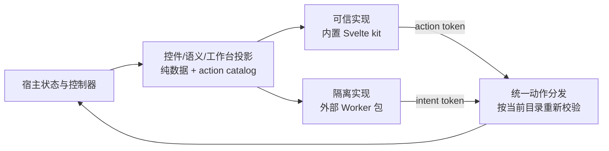

# 内置外观并入 Presentation 合同：迁移计划

状态：P0、P1 已实施（见各阶段实施记录），P2–P3 未实施。本文不改变现行规则；在各阶段验收并同步
[UI 架构](ui-architecture.md)、[Presentation 包合同](presentation-package.md)及对应测试前，
以现行文档为准。

## 背景与问题

外观扩展现在有两条并行通道：

| 通道 | 入口 | 能力范围 | 选择与恢复 |
| --- | --- | --- | --- |
| 内置 UI kit | `src/lib/ui-kit/registry.ts` 注册 `ak-ui`、`material3` | 完整 `UiKitAdapter`（约 30 个组件），Svelte 组件接收回调 | `localStorage` 的 `aibo.appearance.v1`，`{kitId, themeId}` |
| 外部 Presentation 包 | `presentation.json` → 原生安装 → Worker + iframe 绘制桥 | themes、controls（仅 ModelMatrix、AgentStatusMark）、semantic、workbench | 宿主持久化 release 选择，失败回退默认 |

两个内置 kit 共享 `kits/shared/` 的行为组件，差别只在 CSS、`Icon`、`AgentStatusMark`
和 `themes.json`。因此内置 kit 事实上是"主题 + 样式 + 两个图形组件"，却使用一套外部包无法触达的完整组件合同。

由此产生的问题：

1. **外部能力落后于内置能力。** AgentSettingsForm、ModelContextSelect、GoalBar、SubagentCard、
   SubagentDialog、Select 等控件只有内部回调接口，没有纯数据合同，外部包不能定制。
2. **每个外部控件都要手写桥接。** `runtime/ExternalControl.svelte` 按控件名分支，
   在宿主里把 token 映射回回调（例如 `modelSelections`）。每公开一个控件，都要改宿主代码。
3. **身份与生命周期分叉。** 内置外观没有 release、摘要和预检，外观选择与外部包选择是两套存储与回退逻辑。
4. **主题数据有两个来源。** 独立 shadcn/Material 3 包的 `themes.json` 与内置 kit 各自维护，
   `appearance-selection.ts` 还要承担旧偏好迁移。

## 目标与非目标

目标：

- 内置外观成为**预装的可信 Presentation release**，与外部包共用身份、选择、预检、回退和恢复流程。
- 每个可定制的复合控件只有**一份纯数据合同**（data + action catalog），内置 Svelte 实现和外部 Worker 实现消费同一份投影。
- 宿主不再按控件名手写 token→回调的映射。

非目标：

- **不要求**默认工作台改用 Worker 视觉树绘制。内置实现继续在主 WebView 内用 Svelte 渲染，
  以保留性能、输入法、无障碍与现有焦点行为。统一的是合同与生命周期，不是执行方式。
- 不放宽外部包的隔离规则（[ADR-0009](adr/0009-presentation-package-isolation.md)）。
  信任档位来自安装来源（宿主构建内置），不来自 manifest 声明。
- 不改变管理、审批、恢复这些宿主固定区域的归属。

## 目标形态

- **Release 身份**：内置外观提供 `presentation.json`（`aibo.presentation-package/v1`），
  id 为 `dev.aibo.builtin.material3`、`dev.aibo.builtin.ak-ui`，版本随宿主发布。
  不使用 `dev.aibo.presentation.*`：独立的 shadcn/Material 3 外部包已经占用这个命名空间。
  安装记录的来源标记为 `builtin`，只有这一来源允许在主 WebView 执行 Svelte 组件。
- **控件合同**：`packages/plugin-protocol/src/presentation-controls.ts` 为每个公开控件定义
  `{ control, props, actions }`。`actions` 是宿主生成的 token 目录，与现有 ModelMatrix 一致。
- **统一分发**：新增 `presentation-runtime/control-dispatch.ts`，按控件注册表把 token 解析回宿主意图，
  并重新检查 disabled、上下文与 revision。内置实现拿到的回调由分发器生成，
  不再由页面组件直接传入业务回调。
- **`UiKitAdapter` 收缩**：只保留无业务语义的原语（Button、Input、Textarea、Card、Badge、Label、Separator、
  Icon、AlertDialog 等）。复合控件改由"控件注册表 + 内置实现"提供。

## 阶段

### P0：统一身份与选择（不改组件接口）

变更：

- 为 `ak-ui`、`material3` 生成 `presentation.json`，themes 直接取现有 `themes.json`，不含 entry 和 surfaces。
- 原生安装表新增 `source: builtin | local`。启动时幂等登记内置 release；
  同 ID 同版本内容不同时拒绝，与外部包规则一致。
- 外观选择迁移为 `{ packageId, version, themeId }`，由宿主持久化，与外部包选择合并为同一个存储。
  读取 `aibo.appearance.v1` 与旧 shadcn/Material 3 偏好，一次性迁移后保留旧键以便回滚。
- `VITE_AIBO_UI_KIT` 改为映射到内置 packageId，行为不变。

影响：`src/lib/ui-kit/registry.ts`、`appearance-selection.ts`、`external-presentation.ts`、
`src-tauri/src/presentation_packages.rs`、外观设置页面。

验收：

- 旧偏好的全部组合（ak-ui 双主题、material3 六主题、旧 shadcn、旧 `ocean/sage/violet/daylight`、损坏值）迁移结果不变。
- 在内置与外部包之间来回切换，不重置布局、草稿、滚动锚点；外部包失败时回到**上一个**内置选择，而不是固定默认。
- 主题 token 通过与外部包相同的纯数据 token 校验；不通过的 token 在本阶段修正，不放宽校验器。

回滚：保留旧存储键，恢复旧 registry 读取即可，不涉及数据库不可逆变更。

#### P0 实施记录

与上文计划的差异：

| 计划 | 实际 | 原因 |
| --- | --- | --- |
| 安装表新增 `source` 列 | 不改表结构；宿主按保留前缀 `dev.aibo.builtin.` 判定 `source` | 无需数据库迁移；本地安装拒绝该前缀，前缀足以区分 |
| 同 ID 同版本内容不同时拒绝 | 内置行被新构建替换，各窗口的选择迁到新 release，主题不存在时回到默认主题 | 内置内容由宿主构建决定；开发构建常在不升版本时改主题 |
| 选择记为 `{ packageId, version, themeId }` | 沿用现有 `{ digest, themeId }` 按窗口存储 | 与外部包完全同构，不引入第二种选择格式 |
| 外部包失败时回到上一个内置选择 | 自动失败（运行时错误、禁用、不兼容快照、启动损坏）回到上一个内置选择；设置中的"恢复内置皮肤"仍选择产品默认 | 现有探针固定了"显式恢复选择产品默认"的规则 |

新发现并已处理：

- 两套主题的字体 token 带引号，不满足纯数据 token 规则。已去掉引号：多词字体族在 CSS 中不加引号同样有效，外部包构建也是这样做的。
- Material 3 每个主题有 140 个 token，超过合同的 128 上限。`themes.json` 顶层新增 `tokens`，
  存放所有配色共用的 114 个基础 token（主要是角色别名），每个主题只保留 26 个配色值；
  注册表合并后的 token 集合与拆分前一致。ak-ui（111 个）不需要拆分。
- 宿主没有登记内置 release 时（旧宿主、浏览器模拟），首次启动不写选择，行为与之前相同。

验证：
- `pnpm run verify`。
- `cargo test --lib presentation_packages`：包含内置登记幂等、重建替换、选择迁移、停用 kit、保留前缀、禁止禁用/卸载。
- `test/builtin-presentation.test.mjs`、`test/presentation-package-controller.test.mjs`。
- 浏览器探针 `builtin-presentation-browser`（新增）、`presentation-app-browser`、`presentation-full-skins-browser`、`material3-palettes-browser`。

未验证：macOS arm64 原生生命周期（真实安装表、多窗口、升级宿主版本后的替换）。

### P1：通用控件分发，取代手写桥接

变更：

- 定义控件注册表：`control → { project(props): {data, actions}, resolve(token, props): intent }`。
- 将 ModelMatrix、AgentStatusMark 迁到注册表，`ExternalControl.svelte` 不再出现控件名分支。
- 内置实现仍接收原有 props，由适配层从 `{data, actions}` 生成；本阶段不改页面组件。

验收：现有 controls 外部包（shadcn/Material 3 0.3.x、`aibo-plugins/plugins/presentation`）无需重新构建即可继续工作；
控件协议逐字节不变，通过 `test/presentation-*.test.mjs` 与完整外部皮肤探针验证。

#### P1 实施记录

- `presentation-runtime/controls.ts` 的注册表为每个公开控件提供 `project`（纯数据投影）、`resolve`（按当前 props
  把真实用户事件解析为宿主回调）、`preflight` 样例，以及可选的 `decorative` 可访问名称。
  `controlInput`、`controlPreflights`、`modelSelections` 的导出与输出保持不变。
- `ExternalControl.svelte` 不再按控件名分支；新增 `PublicControl.svelte`，统一"有 controls 包时替换、否则由 kit 渲染"的判断，
  ModelMatrix 与 AgentStatusMark 的 runtime proxy 改用它。
- 本阶段没有改页面组件：内置实现仍然接收原有回调 props。

验证：
- `test/presentation-controls.test.mjs`：线上数据与冻结的旧投影逐字节一致；意图只在 click、token 有效且控件未禁用时解析；两个桥接组件中不出现控件名。
- 浏览器探针 `presentation-controls-browser`（含伪造选项被忽略、禁用动作不可用、`null` 继承默认实现）、`presentation-full-skins-browser`。

### P2：逐个公开复合控件

按风险从低到高排序，每个控件单独发布，互不捆绑：

| 顺序 | 控件 | 要点 |
| --- | --- | --- |
| 1 | FileChangeMark、SessionControlMark | 纯展示，无动作 |
| 2 | Select、ModelContextSelect | 单选动作；异步确认前显示宿主值 |
| 3 | AttachmentList、GoalBar | 删除/暂停/恢复动作；预览仍由宿主按 ID 校验 |
| 4 | SubagentCard、SubagentDialog | 打开动作；对话框内容仍为宿主语义视图 |
| 5 | AgentSettingsForm | 草稿属于宿主；需要本地输入动作（沿用 `localInputActions` 与 editSequence 规则） |

每个控件需要：

1. 在 `plugin-protocol` 增加纯数据类型与 JSON schema，并加入 `PresentationControlData` 联合类型；
2. 注册投影与解析，内置实现改为消费投影；
3. 宿主预检该控件（render 返回 `null` 表示继承）；
4. 更新 [Presentation 包合同](presentation-package.md#独立控件呈现)，并按 hostApi 规则判断是否需要升版本。

公开新控件属于新增能力。旧包没有声明该控件时继承默认实现，不需要 hostApi 大版本。
是否引入 hostApi 1.1 由 [ADR-0005](adr/0005-plugin-protocol-stability-and-compatibility.md) 的变更门决定。

ManagementCenter、HostPanel、WorkbenchChrome 属于宿主固定区域或布局外壳，**不公开**，
继续由内置实现提供。

### P3：收缩 UiKitAdapter

- 复合控件全部经注册表后，`UiKitAdapter` 只保留原语；`kits/shared/` 中的复合组件移到
  `ui-kit/controls/`，作为 builtin release 的实现。
- 独立 shadcn/Material 3 包与内置 kit 的主题共用同一份 `themes.json` 源（构建时复制），
  消除双重来源。
- 更新 [UI 架构](ui-architecture.md)的分层表和边界守卫测试（`test/presentation-boundaries.test.mjs`）：
  页面组件不得向复合控件传业务回调。

## 风险与缓解

| 风险 | 缓解 |
| --- | --- |
| 回调改为 token 后，交互增加一层间接，异步确认时机可能变化 | P1 先迁已有协议的两个控件；每个控件都有"确认前显示宿主值"的回归 |
| AgentSettingsForm 草稿在 revision 更新时丢失输入 | 复用已验证的 localInputActions / editSequence 机制，不新造 |
| 内置 release 登记失败导致无外观可用 | 登记失败时仍以宿主构建内的默认实现启动，并在运行时区显示诊断；这个兜底不经过安装表 |
| 主题 token 校验收紧后，现有 ak-ui token 不合规 | P0 验收前修正 token 值，不为内置放宽规则 |

## 待决问题

1. ~~内置 release 版本跟随宿主版本，还是独立版本号？~~ P0 采用跟随宿主版本。
2. ~~是否允许用户"卸载"内置外观？~~ P0 不允许禁用或卸载；是否提供"隐藏"留待需要时再定。
3. 控件公开是否需要按控件粒度声明（`surfaces.controls: ["Select", ...]`）？
   现有 `controls` 角色加 render 返回 `null` 已能表达继承；若包作者反馈预检成本高，再考虑细化。

## 验证

每阶段完成后运行 `pnpm run verify`，并执行[回归矩阵](plugin-boundaries-and-regression.md#regression-gate)中外观、
外部呈现与恢复相关的浏览器探针。P0 与 P2 的 AgentSettingsForm 需要 macOS arm64 原生生命周期复验。
