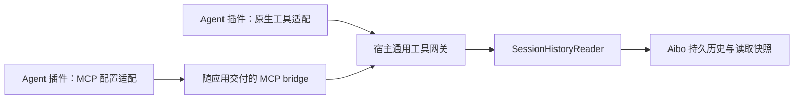

# 完整会话查询工具接入设计（待实现）

本次只实现[会话引用设置](session-context-and-handoff-plan.md)。本文是后续接入方案，
不是已发布能力；当前引用仍明确告知 Agent 没有按需读取工具。

## 决策

由宿主提供一个 `SessionHistoryReader` 模块，统一读取 Aibo 持久化原文、校验权限、
冻结读取版本、分页及处理大消息。对 Agent 公开 `aibo_read_session` 工具。
默认通过宿主随应用交付的 MCP stdio bridge 暴露；原生 SDK 工具适配器消费同一个工具目录。
新增 Agent 只在它自己的插件内接入通用工具传输，不修改宿主读取逻辑或按 Agent 身份分支。



MCP 标准提供工具发现与调用；stdio 由客户端启动子进程，通过标准输入输出通信。
协议实现应使用兼容目标客户端版本的官方 SDK，不能仅实现两条 RPC 并声称完整支持 MCP。
参见 [MCP 工具规范](https://github.com/modelcontextprotocol/modelcontextprotocol/blob/main/docs/specification/2026-07-28/server/tools.mdx)
与 [stdio 规范](https://github.com/modelcontextprotocol/modelcontextprotocol/blob/main/docs/specification/2026-07-28/basic/transports/stdio.mdx)。
本文的授权、读取快照和分页是 Aibo 的应用合同，不依赖 MCP 连接是否有状态。

## 现有链路及需要补齐的接口

- `src-tauri/src/session_context.rs` 已从 Core 数据库捕获引用，无需启动来源 Agent。
- `src-tauri/capability-plugins/session-provider.mjs` 已提供 `requestTool`，经
  `workspace.requested` 与 `aibo.session.tool.respond` 完成请求/响应。
- `src-tauri/src/session_tools.rs` 当前处理文件/命令工具，并拒绝 agent-managed 执行后端。
  **不能为接入会话读取而删除这道限制**：原生 Agent 权限不等于 Core 文件/命令授权。
- 当前没有可向任意插件注入的宿主工具目录，也没有宿主会话历史 MCP server。
  仅增加 Rust 读取函数不会让模型自动获得工具。

新增版本化的宿主工具接入合同，例如 `hostTools/v1`，与会话提供者自身的
`session.snapshot` / `session.timeline` 能力区分。目录中的每个工具包含稳定 ID、版本、
描述、输入/输出 schema、只读属性和所需宿主授权。宿主基于实际协商结果提供目录，
不根据插件品牌推断支持。SDK 的通用适配器从目录生成模型工具定义并转发调用。

宿主在 open/resume 的受控调用上下文中提供工具连接描述（bridge 可执行文件、参数、
私有 IPC 地址、会话凭证、有效期及合同版本）；厂商的 MCP 参数或原生注册方式仅由
对应插件转换。连接信息与凭证不进入模型提示、recovery、会话原文或普通日志。
插件须返回实际注册成功的工具/合同版本；宿主据此生成引用中的读取说明。
恢复、换代或重启重新签发凭证，不复用旧会话的连接信息。

新增这些字段时，应同步更新协议类型/schema、Broker 上下文校验、SDK、插件握手、
打包和开发文档；旧插件缺字段时保持不可读取状态。传输适配不能使原有工具权限扩大。

## 单一工具的建议合同

工具名称：`aibo_read_session`。第一版只读取当前回合明确引用的来源会话，避免开放全库。

首次请求示例：

```json
{
  "referenceId": "引用附件 snapshotId",
  "sessionId": "sourceSessionId",
  "pageBytes": 32768
}
```

续页只提交宿主返回的 opaque `cursor`（和可选的较小 `pageBytes`），不能更换来源。
`referenceId` 确定授权来源，`sessionId` 只用于防止误读，不作为授权依据。
调用者 session/workspace/turn 身份由工具连接绑定，禁止模型传入或覆盖。
工具 schema 显式区分首次请求和续页，拒绝混用与未知字段。

建议输出：

```json
{
  "source": "persisted-core",
  "sessionId": "来源会话 ID",
  "referenceCapturedAt": "引用创建时间",
  "readSnapshotId": "读取时冻结的版本 ID",
  "readCapturedAt": "查询原文时的时间",
  "throughMessageId": "本次读取最后一条消息 ID",
  "historyScope": "Aibo persisted history only",
  "messages": [
    {
      "id": "消息 ID",
      "role": "assistant",
      "status": "completed",
      "content": "原始正文的当前分片",
      "contentOffset": 0,
      "contentComplete": true
    }
  ],
  "nextCursor": null,
  "complete": true
}
```

“完整”指宿主已持久化的历史，包括用户、assistant、system 和 tool 记录；原文不摘要、
不按 1500 字符截断、不递归展开嵌套引用。工具记录保留已存储的结构化字段，附件返回
元数据及是否另需授权读取；不把外部文件字节或宿主未保存的原生历史冒充为完整内容。
工具数据是参考材料，不增加执行授权。

单页默认 32 KiB，上限建议 64 KiB，计算序列化后的完整响应大小。大消息分片，
游标包含消息位置与 UTF-8 安全的分片偏移；不得因一条消息超限而永远无法读完。
返回 `nextCursor=null` 且 `complete=true` 才代表遍历结束。首版不加全文搜索；
未来搜索共用相同授权与读取版本，不单独读取数据库。

## 一致性与资源界限

引用快照仅保存选中的对话，无法重建当时未保存的工具输出。首次查询在一个 SQLite
读事务中建立**查询时**的不可变读取快照，以固定排序 `(created_at, sequence, id)`
冻结消息、正文、状态及结构化字段。后续页读取该快照；来源继续流式输出不改变续页。
`referenceCapturedAt` 与 `readCapturedAt` 必须同时明确，不能声称读取结果就是引用时原文。
可以使用引用的消息边界限制成员，但仅限制 ID 范围不足以冻结可变的消息正文。

快照写入宿主私有临时存储，流式复制以限制内存，按回合/会话设置磁盘配额、超时及 TTL。
这些具体限额在实现时基于真实历史验证；配额不足明确失败，不静默省略。
不为模型思考期间保留长时间 SQLite 事务。游标过期返回 `snapshot_expired`，要求明确
重新读取；不静默换成新历史。首次建快照失败清理半成品，回合关闭与退出回收资源。

## 授权与运行时

1. 宿主根据已经接受的回合输入与真实附件归属建立可读来源集合。仅添加到草稿、
   伪造提示中的 ID、同工作区任意 ID 都不自动授权；队列按实际被接受的消息绑定。
2. 凭证由宿主生成、短期有效，绑定 installation/contribution、运行代际、工作区、
   调用会话、当前回合和工具 allowlist。使用受控本地 IPC，不直接向 Agent 提供 SQLite 路径。
3. 每次调用重新核验活跃回合、来源引用归属、工作区边界及信任撤销；过期、取消、
   runtime 换代、跨会话/跨工作区或伪造 cursor 均拒绝。来源 Agent 不必在线，归档可读。
4. 这是一条宿主只读历史权限路径，独立于 CoreProxy 的文件/命令权限。新工具路由只
   接受目录中经授权的历史工具，不能通过参数任意转发到原有 `session_tools`。
5. 请求/结果遵守大小、并发、速率和取消约束；审计记录来源、边界、版本和结果，不
   再把完整工具响应复制进日志。断连结算 pending，取消阻止后续读取。

## 新 Agent 的接入验收

新增 Agent 的可重复流程应为：安装插件 → 声明支持的工具传输/合同 → 适配 MCP 配置
或使用 SDK 动态工具注册 → 注册成功确认 → 正常调用。不编辑宿主 Agent 注册表、
历史 SQL、业务控制器或按品牌补提示。新增工具也只扩展宿主目录，无需逐插件列出工具。
不支持 MCP 或工具注册的引擎明确标为不支持；不能承诺任意引擎零适配即可使用。

实现时至少验证：

- 两个不同身份的适配器通过相同合同读取；未知第三方、缺少支持与旧 release 安全降级。
- tools/list / tools/call 或 SDK 等价路径，真实模型可见目录，打包 bridge 能独立启动。
- 历史超过单页、单条超大、Unicode 分片、空历史、归档、工具消息与流式更新。
- 游标篡改/过期、跨会话/跨工作区、草稿未发送、取消/信任撤销/换代、资源配额与清理。
- 只读模式和 agent-managed 模式均可在明确历史授权后读取，而文件/命令权限保持原样。
- 升级后新旧固定 release，进程重启恢复，普通回合、队列、附件及引用不可变性。

按[宿主回归门槛](plugin-boundaries-and-regression.md#regression-gate)运行 Node、Rust、
打包 Worker、真实 CLI 与桌面检查。模拟回调通过不代表实际 Agent 已注册并调用工具。
