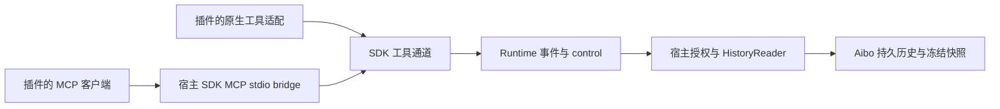

# 完整会话查询工具

已实现宿主工具目录、历史读取器和公共 SDK 传输。引用设置决定随提示发送全部或最近 N 条
用户/assistant 消息；`aibo_read_session` 让支持工具的 Agent 按需读取来源会话的持久化原文。
新增 Agent 只需在插件中适配工具注册，不修改宿主业务代码、SQL 或品牌分支。

## 接入合同

- 最低宿主 SDK `0.1.1`，Manifest v2、Runtime 2.1。session contribution 声明
  `hostTools: ["aibo.host-tools/v1"]` 和标准 `aibo.session.tool.respond` 操作，schema
  必须精确匹配 [基础合同](../contracts/session-capabilities.v1.json)。initialize 返回对应操作三元组。
- Broker 校验清单和握手后，在可信 `context.hostTools` 注入
  [版本化工具目录](../contracts/host-tools.v1.json)，包含名称、描述、输入/输出 schema 和只读提示。
- 插件通过 `@aibo/capability-runtime/host-tools` 的 `hostToolDefinitions(context)` 取得目录。
  原生 SDK 从目录生成动态工具，回调使用 `createHostToolChannel().call(name, input)`。
  MCP 客户端使用 `createHostToolMcpBridge({definitions, call})` 返回的 stdio 配置。
- 每次 invoke 调用 `channel.begin(request, tools, getNativeSessionId)`，在 finally 执行返回的清理函数。
  `aibo.session.tool.respond` control 转给 `channel.respond(input)`；通道自动发出
  `workspace.requested`，绑定当前 invocation、nativeSessionId 和 turnId。
- 原生注册成功后 open 返回 `host-tools` capability。宿主取返回值、清单及握手的交集。
  缺少目录时不注册、不声明；旧 release 继续普通会话。引擎拒绝注册时保留真实错误，不能伪称支持。
- 新接入宿主工具的 provider 不因声明 `tool.respond` 自动获得 Core 文件/命令代理。
  如确实实现该代理，还须声明 `executionPolicy: "core-proxy"` 并满足原有操作合同；
  没有 hostTools 字段的旧 provider 保持原有协商规则。原生可信授权与 agent-managed 路径保持独立。



工具名只在宿主目录和读取路由中定义。插件遍历目录，不复制业务 schema，不直接打开数据库。
示例实现：[公共 SDK](../packages/capability-runtime/host-tools.mjs)、
[Codex 原生适配](../src-tauri/capability-plugins/codex/engine.mjs)、
[Pi 原生适配](../src-tauri/capability-plugins/pi/engine.mjs)。

## MCP 与原生适配

SDK 使用官方 `@modelcontextprotocol/sdk`，随宿主发布编译后的 stdio bridge；外部插件无需
携带 MCP SDK 或访问应用 node_modules。插件 Worker 建立仅绑定 `127.0.0.1` 的私有 relay，
每次创建生成随机 bearer 凭证，通过子进程环境传递。relay 只提供目录和工具调用，不提供 SQL。
凭证不进入模型提示、recovery 或宿主消息。连接关闭销毁监听器与 sockets；新进程生成新凭证。
SDK 是分发边界，不是隔离恶意本地插件的 OS 沙箱。

Codex 在 `thread/start.dynamicTools` 注册，并将 `item/tool/call` 映射回宿主。恢复时按 recovery
保存的工具名称和当前目录取交集；原生线程已持久化工具定义，导入的旧线程没有工具声明时安全降级。
该接口是实验性协议，依据本机生成 schema 及 [官方 App Server 文档](https://developers.openai.com/codex/app-server/)。
Pi 在 `createAgentSession` 中注册 custom tools，恢复时重新注册当前目录。
Cursor 插件将公共 bridge 配置映射为 ACP `session/new` / `session/load` 的 `mcpServers`；
厂商参数转换全部位于插件内。Cursor MCP 发现可能延迟到首个 prompt；恢复保留公开 server 标识，
轮换私有凭证。只读自动许可按原生结构化 server/tool 标识及当前 tool_call ID 关联，
仅允许私有宿主目录中的只读工具一次，标题、永久许可及其他工具不会获得该授权。

## 读取合同

首次调用：

```json
{"referenceId":"引用附件的 snapshotId","sessionId":"sourceSessionId","pageBytes":32768}
```

续页：

```json
{"cursor":"上次返回的 nextCursor","pageBytes":32768}
```

不允许混用 cursor 与来源字段。调用者身份来自宿主运行时，不接受模型覆盖。
响应包含 `source: "persisted-core"`、`sessionId`、`referenceCapturedAt`、`readSnapshotId`、
`readCapturedAt`、`throughMessageId`、`historyScope`、`format: "jsonl"`、`content`、字节 `offset`、
`nextCursor` 和 `complete`。将 `content` 按 offset 拼接后按行解析 JSON；单页可以在一条
JSONL 记录内部结束，UTF-8 字符不会被拆开。只有 `complete=true` 且 `nextCursor=null` 才代表结束。

消息记录保留宿主持久化的 user、assistant、system、tool 原文与已有工具字段、状态、时间、
顺序及原生消息 ID；附件返回元数据和 `fileBytesIncluded: false`。不摘要、不递归展开嵌套引用。
范围是 Aibo 已保存的主会话历史，不包含导入前未保存的原生历史、子 Agent 历史或附件文件字节。
这些内容只是参考资料，不增加执行授权。

## 一致性、授权和限额

首次查询在一个 SQLite 读事务中，按 `(created_at, sequence, id)` 冻结消息及附件元数据。
它是**读取时**的版本，不是引用创建时的完整历史；响应分别标明两个时间。
事务在生成快照后结束，来源继续流式输出不改变续页内容。

首版采用有界内存快照：单个最多 16 MiB，总缓存最多 64 MiB，每回合最多 4 个快照，
TTL 为 10 分钟（后续读取清理过期项），回合结算立即清理。重复首次请求复用相同冻结快照。
附件记录最多 10,000 条；超限返回 `resource_limit`，不静默截断。尚未实现磁盘流式快照，
因此超过限额的历史明确无法通过此工具读取。

单页完整 JSON 响应默认 32 KiB，允许 4–64 KiB；游标签名绑定读取版本、字节偏移、
调用会话、回合和运行代际。过期返回 `snapshot_expired`，需要明确开始新读取。
SDK 每回合最多 8 个并发请求，输入最多 128 KiB，单次最长 30 秒且不超过 invocation deadline。
取消或回合结束结算 pending；迟到响应和旧代际请求拒绝。

每次读取，包括续页，都检查：

1. 活跃回合、nativeSessionId、实际协商的 host-tools 和运行代际。
2. 真实引用附件属于调用会话和该回合；已接受的 user 消息携带相同 snapshotId/contentHash。
   仅草稿、任意同工作区会话 ID 或伪造提示不能授权。
3. 来源和目标在同一受信工作区，来源与目标不同；信任撤销立即拒绝。来源可归档、可离线。
4. 历史工具专用只读路由先处理；Core 文件/命令路由仍保留 agent-managed 拒绝和原有审批。

## 验证

- `test/host-tools.test.mjs`：通道绑定、取消、官方 MCP 客户端发现/调用/错误/凭证、
  不同工具名称的通用目录，Codex/Pi 注册、调用、跨进程恢复和无目录普通会话。
- Rust `session_history_tools`：草稿/伪造/跨工作区拒绝、归档、大消息 Unicode 分片、tool/system、
  冻结版本、游标篡改/过期/代际、信任撤销、资源限额、回合关闭与清理。
- Rust `third_party_agent_managed_history_tools_use_host_scope_without_core_file_authority`：
  改名第三方插件从清单/握手到数据库原文读取及恢复，同时证明不能调用 Core 文件工具。
- 外部 Cursor 包 smoke：实际 MCP stdio 客户端经过打包 Worker 完成 tools/list、tools/call 和恢复。
- `node probes/host-tools-native.mjs codex|pi|cursor`：临时工作区、合成历史的真实模型调用及重启恢复。
  2026-09-26–27，macOS arm64、Node 24.18.0：Codex CLI 0.156.1、Pi SDK 0.84.4 和
  Cursor CLI 2026.09.18-9a7762b 在 Ask/只读配置下的实际调用及跨进程恢复通过。
  此探针验证原生工具传输；数据库授权由上面的 Rust 集成测试覆盖。

本次不涉及 UI 控件变化，未做桌面点击和截图验收。新内置 release 为 Codex 2.0.15、Pi 2.0.10；
外部 Cursor 0.1.18 需重新构建安装。已有会话仍固定原 release，使用新会话验证新能力。

最终回归：宿主 `pnpm run verify` 通过（41 项架构检查、457 项 Node 测试、类型检查与构建）；
`cargo test --manifest-path src-tauri/Cargo.toml --lib` 为 260 通过、1 项既有忽略；
外部插件 `pnpm run verify` 通过（54 项测试与离线打包 MCP smoke）。修改文档的相对链接及 diff 检查通过。
